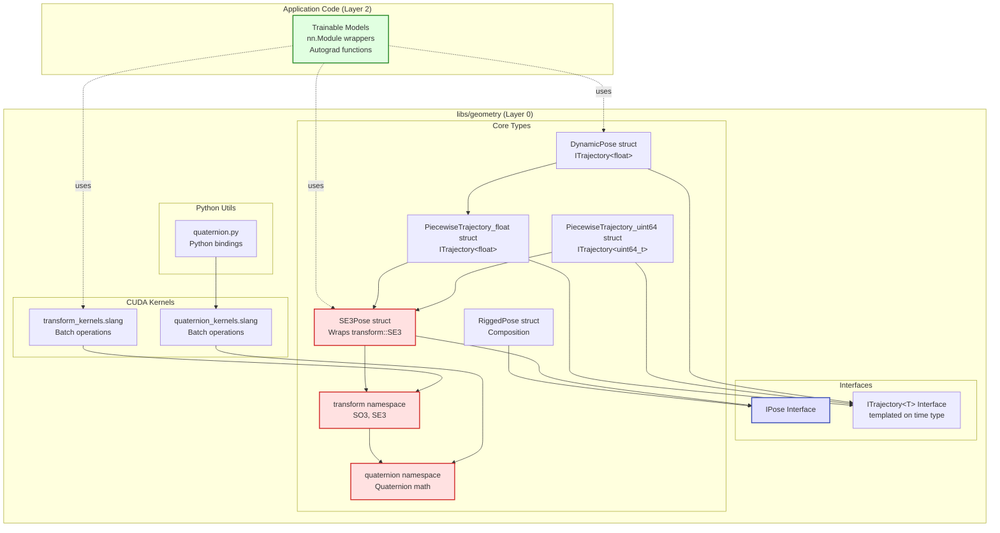

# Geometry Module Architecture

**Module Path:** `libs/geometry/`

---

## 1. Overview

The geometry module provides **Layer 0 fundamental geometric primitives** - core Slang types, interfaces, and device functions for 3D transformations. It is a low-level library focused on performance and correctness, not trainable models.

**Scope:** This module implements **Layer 0 only**. It provides:

- Static transformations (poses)
- Time-varying transformations (trajectories with normalized or absolute time)
- Core interpolation and composition operations

Higher-level abstractions (trainable nn.Module wrappers, optimization logic) belong in application code.

### 1.1 Key Components

1. **Quaternions** (`quaternion.slang`)

   - Core quaternion math operations
   - SLERP (spherical linear interpolation)
   - Conversion to/from rotation matrices

2. **Transformations** (`transform.slang`)

   - `transform::SO3` - 3D rotations
   - `transform::SE3` - Rigid body transformations (rotation + translation)
   - Interpolation and composition operations

3. **Pose Interface** (`pose.slang`)

   - `IPose` - Interface for static transformations
   - `SE3Pose` - Thin wrapper around `transform::SE3` adding `IPose` interface
   - `RiggedPose` - Composition of sensor-to-rig + rig-to-world transforms

4. **Trajectory Types** (`pose.slang`)
   - `ITrajectory<T>` - Generic interface for time-varying transformations (templated on time type T)
   - `PiecewiseTrajectory<T>` - Piecewise interpolation between SE3 control poses (works with any time type)
   - `DynamicPose` - Implements `ITrajectory<float>` for normalized time [0, 1] (rolling shutter, exposure motion)

### 1.2 Design Principles

1. **Layer 0 Focus**: Core Slang kernels and types only
2. **Interface-Based Polymorphism**: `IPose` enables compile-time dispatch in Slang
3. **Differentiability**: All operations support automatic differentiation
4. **Performance**: GPU-accelerated device functions
5. **Type Safety**: Strong typing through Slang interfaces
6. **Composability**: Simple primitives that can be composed into complex transformations

### 1.3 Module Structure



**Key Insight:** The geometry module provides **building blocks**, not complete solutions. Application code combines these primitives into trainable models as needed.

---

## 2. Layer 0: Slang Kernels & Types

The geometry module implements Layer 0 only - core Slang types, interfaces, and device functions.

### 2.1 Quaternion Utilities

**Module:** `libs/geometry/kernels/quaternion.slang`

**Purpose:** Core quaternion operations for efficient 3D rotations.

```slang
// Quaternion representation: (x, y, z, w)
// Unit quaternion represents a rotation in 3D space

// Rotate a 3D point by a quaternion
// Uses optimized formula: q * p * q^(-1)
[Differentiable]
float3 quat_rotate_point(float4 q, float3 p);

// Rotate a batch of points by a quaternion (GPU kernel)
[Differentiable]
[shader("compute")]
[numthreads(256, 1, 1)]
void quat_rotate_points_kernel(
    float4 q,                                  // Unit quaternion (x, y, z, w)
    StructuredBuffer<float3> points_in,        // (N, 3) input points
    RWStructuredBuffer<float3> points_out,     // (N, 3) output points
    uniform uint3 dispatchThreadID : SV_DispatchThreadID
);

// Quaternion multiplication (composition of rotations)
// Result: q1 * q2 (apply q2 first, then q1)
[Differentiable]
float4 quat_multiply(float4 q1, float4 q2);

// Quaternion conjugate (inverse rotation for unit quaternions)
[Differentiable]
float4 quat_conjugate(float4 q);

// Quaternion inverse (for non-unit quaternions)
[Differentiable]
float4 quat_inverse(float4 q);

// Spherical linear interpolation (SLERP) between two quaternions
// Ensures shortest path and handles close quaternions with linear interpolation
[Differentiable]
float4 quat_slerp(float4 q1, float4 q2, float t);

// Convert rotation matrix to quaternion
[Differentiable]
float4 matrix_to_quat(float3x3 R);

// Convert quaternion to rotation matrix
[Differentiable]
float3x3 quat_to_matrix(float4 q);
```

---

### 2.2 IPose Interface

**Module:** `libs/geometry/kernels/pose.slang`

**Purpose:** Core interface that all pose types must implement. Enables compile-time polymorphism in GPU kernels.

```slang
// Core pose interface - all pose types implement this
// A pose is a static transformation (no temporal component)
interface IPose {
    // Transform a 3D point from source frame to target frame
    [Differentiable]
    float3 transform_point(float3 point);

    // Transform a direction vector (no translation)
    [Differentiable]
    float3 transform_direction(float3 direction);

    // Inverse transformation (target → source)
    [Differentiable]
    float3 inverse_transform_point(float3 point);

    [Differentiable]
    float3 inverse_transform_direction(float3 direction);
}
```

**Notes:**

- Poses are **purely static** transformations with no temporal component
- All methods are `[Differentiable]` for gradient-based optimization
- Interface methods enable compile-time dispatch (zero runtime overhead)
- For time-varying transformations, use the `ITrajectory<T>` interface or its implementations:
  - `DynamicPose`: For rolling shutter and motion during exposure (normalized time [0, 1])
  - `PiecewiseTrajectory<uint64_t>`: For SLAM and multi-frame trajectories (absolute timestamps)
- Poses can be composed (e.g., `RiggedPose` composes sensor-to-rig and rig-to-world)

---

### 2.3 Trajectory Interfaces

**Module:** `libs/geometry/kernels/trajectory.slang`

**Purpose:** Interfaces for time-varying transformations. Trajectories interpolate between poses over time.

#### 2.3.1 Trajectory Interface (Templated on Time Type)

```slang
// Boundary mode for out-of-bounds trajectory queries
enum BoundaryMode {
    CONSTANT = 0,      // Return boundary pose (first/last) - safe default
    EXTRAPOLATE = 1,   // Extrapolate using boundary velocities
    ERROR = 2          // Mark query as invalid (sets valid=false)
}

// Generic trajectory interface - templated on time type
// T: Time type (float for normalized [0,1], uint64_t for absolute timestamps)
interface ITrajectory<T> {
    // Get pose at specific time
    [Differentiable]
    IPose get_pose_at(T t);

    // Transform a point at a specific time
    [Differentiable]
    float3 transform_point_at(float3 point, T t);

    // Transform a direction at a specific time
    [Differentiable]
    float3 transform_direction_at(float3 direction, T t);
}
```

**Design Notes:**

- **Time Type `T`**: Can be `float` for normalized time [0, 1] or `uint64_t` for absolute microsecond timestamps
- **Instantiations**:
  - `ITrajectory<float>`: For rolling shutter, motion blur, short exposures (normalized time)
  - `ITrajectory<uint64_t>`: For SLAM, multi-frame optimization, long-term motion (absolute timestamps)
- The interface intentionally does not include `mean()` - that's specific to `DynamicPose` implementation
- For long-term trajectories (SLAM, etc.), use `PiecewiseTrajectory<uint64_t>` directly

---

### 2.4 Pose Data Structures

#### 2.4.1 SE3 Pose (Quaternion Representation)

**Module:** `libs/geometry/kernels/pose.slang`

**Purpose:** Standard SE(3) transformation represented as translation + rotation quaternion. This is a thin wrapper around `transform::SE3` that adds the `IPose` interface.

**Design Note:** Timestamps belong in Trajectories, not in Poses. A Pose is a purely static transformation. For time-varying transformations, use trajectories (e.g., `PiecewiseTrajectory` or `DynamicPose`) which store poses along with their associated timestamps.

```slang
struct SE3Pose : IPose {
    transform::SE3 se3;    // Internal SE3 transformation (translation + rotation quaternion)

    // Accessor properties for convenience (forward to internal SE3)
    property float3 translation { get; set; }
    property float4 rotation { get; set; }

    // IPose interface implementation
    // Apply rotation then translation: T * p = R(p) + t
    [Differentiable]
    float3 transform_point(float3 point);

    // Rotate direction vector (no translation)
    [Differentiable]
    float3 transform_direction(float3 direction);

    // Inverse transform: T^(-1) * p = R^T * (p - t)
    [Differentiable]
    float3 inverse_transform_point(float3 point);

    // Inverse rotation only
    [Differentiable]
    float3 inverse_transform_direction(float3 direction);

    // Utility constructors
    static SE3Pose from_translation_quaternion(float3 t, float4 q);
    static SE3Pose identity();

    // Get as 4x4 matrix (for compatibility)
    float4x4 to_matrix();
}
```

#### 2.4.2 Rigged Pose (Composition of Poses)

**Module:** `libs/geometry/kernels/rigged_pose.slang`

**Purpose:** Composes two poses representing a sensor mounted on a rig:

1. Static sensor-to-rig calibration (`T_sensor_rig`)
2. Rig-to-world transform (`T_rig_world`)

Templated on both sensor and rig pose types for maximum flexibility.

**Note on Time-Varying Motion:**

- Both poses in `RiggedPose` are static (no temporal component)
- For time-varying rig motion (e.g., moving vehicle), use a trajectory (e.g., `DynamicPose` or `PiecewiseTrajectory<uint64_t>`) directly rather than composing with `RiggedPose`
- The sensor-to-rig calibration is typically static (fixed mounting), while the rig-to-world transform may vary over time

```slang
struct RiggedPose<SensorPose: IPose, RigPose: IPose> : IPose {
    SensorPose T_sensor_rig;                 // Static sensor → rig transform (owned)
    ref RigPose T_rig_world;                 // Rig → world transform (shared reference)

    // IPose interface implementation
    // Transform chain: sensor → rig → world
    [Differentiable]
    float3 transform_point(float3 point);

    // Transform direction through sensor → rig → world
    [Differentiable]
    float3 transform_direction(float3 direction);

    // Inverse transform: world → rig → sensor
    [Differentiable]
    float3 inverse_transform_point(float3 point);

    [Differentiable]
    float3 inverse_transform_direction(float3 direction);
}
```

---

### 2.5 Trajectory Data Structures

#### 2.5.1 Piecewise Trajectory (Two Concrete Implementations)

**Module:** `libs/geometry/kernels/pose.slang`

**Purpose:** Time-indexed trajectory with piecewise interpolation between SE3 control poses. Two concrete implementations are provided:

- **`PiecewiseTrajectory_float`**: For normalized time [0, 1] (implements `ITrajectory<float>`)
- **`PiecewiseTrajectory_uint64`**: For absolute timestamps in microseconds (implements `ITrajectory<uint64_t>`)

Both share the same interface and behavior, differing only in the time type used for control points.

**Requirements:**

- **Minimum 1 control pose**: Can return a constant pose
- **Minimum 2 control poses**: Required for interpolation or `EXTRAPOLATE` boundary mode

**Interpolation Method:**

- Translations: Linear interpolation
- Rotations (quaternions): SLERP (Spherical Linear Interpolation) via `quat_slerp()`
  - Ensures constant angular velocity and geodesic path on quaternion sphere
  - Mathematically correct approach for quaternion interpolation

**Out-of-Bounds Behavior:**
The trajectory supports three boundary modes for handling queries outside `[control_times[0], control_times[N-1]]`:

1. **`CONSTANT`** (default): Returns boundary pose (first/last control pose)

   - Safe default for most use cases
   - Pose remains constant outside trajectory bounds
   - Works with any number of control poses (≥ 1)

2. **`EXTRAPOLATE`**: Extrapolates using boundary velocities

   - **Requires at least 2 control poses** to compute velocity
   - Uses linear extrapolation for translations
   - Uses SLERP extrapolation for rotations (constant angular velocity)
   - Useful for short-term predictions
   - Can produce unrealistic results far outside trajectory range
   - Sets `valid=false` if fewer than 2 control poses available

3. **`ERROR`**: Marks query as invalid
   - Returns boundary pose but sets `valid` output flag to `false`
   - Strict mode useful for debugging and catching logic errors
   - Does not throw exceptions (GPU-compatible)

```slang
// Boundary mode enum for out-of-bounds queries
enum BoundaryMode {
    CONSTANT = 0,      // Return boundary pose (default)
    EXTRAPOLATE = 1,   // Extrapolate using boundary velocities
    ERROR = 2          // Mark query as invalid
}

// Piecewise trajectory with normalized time [0, 1]
struct PiecewiseTrajectory_float : ITrajectory<float> {
    StructuredBuffer<SE3Pose> control_poses;   // (N,) control poses
    StructuredBuffer<float> control_times;     // (N,) normalized times [0, 1]
    uint control_count;                        // Number of control poses

    // Get pose with boundary mode control
    [Differentiable]
    SE3Pose get_pose_at(float t, BoundaryMode mode, out bool valid);

    // Get pose with default CONSTANT boundary mode
    [Differentiable]
    SE3Pose get_pose_at(float t);

    // Transform methods (with and without boundary mode control)
    [Differentiable]
    float3 transform_point_at(float3 point, float t, BoundaryMode mode, out bool valid);
    [Differentiable]
    float3 transform_point_at(float3 point, float t);

    [Differentiable]
    float3 transform_direction_at(float3 direction, float t, BoundaryMode mode, out bool valid);
    [Differentiable]
    float3 transform_direction_at(float3 direction, float t);
}

// Piecewise trajectory with absolute timestamps (microseconds)
struct PiecewiseTrajectory_uint64 : ITrajectory<uint64_t> {
    StructuredBuffer<SE3Pose> control_poses;     // (N,) control poses
    StructuredBuffer<uint64_t> control_times;    // (N,) timestamps in microseconds
    uint control_count;                          // Number of control poses

    // Same interface as PiecewiseTrajectory_float, but with uint64_t time type
    [Differentiable]
    SE3Pose get_pose_at(uint64_t t, BoundaryMode mode, out bool valid);
    [Differentiable]
    SE3Pose get_pose_at(uint64_t t);

    // Transform methods (with and without boundary mode control)
    [Differentiable]
    float3 transform_point_at(float3 point, uint64_t t, BoundaryMode mode, out bool valid);
    [Differentiable]
    float3 transform_point_at(float3 point, uint64_t t);

    [Differentiable]
    float3 transform_direction_at(float3 direction, uint64_t t, BoundaryMode mode, out bool valid);
    [Differentiable]
    float3 transform_direction_at(float3 direction, uint64_t t);
}
```

#### 2.5.2 Dynamic Pose (Normalized Time)

**Module:** `libs/geometry/kernels/pose.slang`

**Purpose:** Time-varying pose over normalized time [0, 1]. Used for rolling shutter and motion during exposure.

```slang
// Dynamic pose using piecewise trajectory with normalized time
struct DynamicPose : ITrajectory<float> {
    PiecewiseTrajectory_float trajectory;  // Normalized time [0, 1]

    // ITrajectory<float> interface implementation
    [Differentiable]
    SE3Pose get_pose_at(float t);  // t in [0, 1]

    [Differentiable]
    float3 transform_point_at(float3 point, float t);

    [Differentiable]
    float3 transform_direction_at(float3 direction, float t);

    // Additional method specific to DynamicPose (not part of ITrajectory interface)
    // Get mean pose over the normalized time range [0, 1]
    // Useful for rolling shutter approximations
    [Differentiable]
    SE3Pose mean();
}
```

**Usage Example (Rolling Shutter):**

```slang
// Create dynamic pose for rolling shutter camera
DynamicPose camera_motion;
// control_times = [0.0, 0.5, 1.0]
// control_poses = [pose_start, pose_mid, pose_end]

// Get pose at 30% through the exposure
SE3Pose pose_at_30pct = camera_motion.get_pose_at(0.3);

// Transform point accounting for motion during exposure
float3 projected = camera_motion.transform_point_at(world_point, 0.3);

// Get mean pose for approximations
SE3Pose mean_pose = camera_motion.mean();
```

**Usage Example (Long-Term SLAM Trajectory):**

```slang
// For SLAM or multi-frame trajectories, use PiecewiseTrajectory directly with absolute timestamps
PiecewiseTrajectory<uint64_t> slam_trajectory;
// control_times = [1000000, 1100000, 1200000, ...]  (microseconds)
// control_poses = [pose_0, pose_1, pose_2, ...]

// Get pose at specific timestamp (default CONSTANT boundary mode)
SE3Pose pose_at_time = slam_trajectory.get_pose_at(1150000);

// Transform point at specific time
float3 world_point = slam_trajectory.transform_point_at(sensor_point, 1150000);

// Use ERROR mode to detect out-of-bounds queries
bool valid;
SE3Pose pose = slam_trajectory.get_pose_at(query_time, BoundaryMode.ERROR, valid);
if (!valid) {
    // Handle out-of-bounds query
}

// Use EXTRAPOLATE mode for short-term prediction
// Note: Requires at least 2 control poses, otherwise sets valid=false
SE3Pose predicted_pose = slam_trajectory.get_pose_at(
    future_time,
    BoundaryMode.EXTRAPOLATE,
    valid
);
if (!valid) {
    // Either out of bounds or insufficient control poses for extrapolation
}
```

---

### 2.6 Python Quaternion Utilities

**Module:** `libs/geometry/kernels/quaternion.py`

**Purpose:** Python bindings and utilities for quaternion operations.

```python
import torch
from torch import Tensor

def quat_rotate_point(q: Tensor, p: Tensor) -> Tensor:
    """Rotate 3D point(s) by quaternion.

    Args:
        q: (4,) quaternion (qx, qy, qz, qw)
        p: (..., 3) point(s) to rotate

    Returns:
        (..., 3) rotated point(s)
    """

def quat_multiply(q1: Tensor, q2: Tensor) -> Tensor:
    """Multiply two quaternions (composition of rotations).

    Args:
        q1: (4,) first quaternion (qx, qy, qz, qw)
        q2: (4,) second quaternion (qx, qy, qz, qw)

    Returns:
        (4,) result quaternion q1 * q2
    """

def quat_conjugate(q: Tensor) -> Tensor:
    """Quaternion conjugate (inverse rotation for unit quaternions).

    Args:
        q: (4,) quaternion (qx, qy, qz, qw)

    Returns:
        (4,) conjugate quaternion
    """

def quat_slerp(q1: Tensor, q2: Tensor, t: float | Tensor) -> Tensor:
    """Spherical linear interpolation between two quaternions.

    Args:
        q1: (4,) start quaternion (qx, qy, qz, qw)
        q2: (4,) end quaternion (qx, qy, qz, qw)
        t: interpolation parameter [0, 1]

    Returns:
        (4,) interpolated quaternion
    """

def matrix_to_quat(R: Tensor) -> Tensor:
    """Convert rotation matrix to quaternion.

    Args:
        R: (3, 3) rotation matrix

    Returns:
        (4,) unit quaternion (qx, qy, qz, qw)
    """

def quat_to_matrix(q: Tensor) -> Tensor:
    """Convert quaternion to rotation matrix.

    Args:
        q: (4,) unit quaternion (qx, qy, qz, qw)

    Returns:
        (3, 3) rotation matrix
    """
```

---

## 3. Using Geometry Primitives in Application Code

The geometry module provides **Layer 0 building blocks only**. Applications should create their own Layer 2 models (nn.Module) that use these primitives.

### Example: Creating a Trainable Pose Model

```python
import torch
import torch.nn as nn
from libs.geometry.kernels import quaternion as quat

class TrainableSE3Pose(nn.Module):
    """Trainable SE3 pose using geometry primitives."""

    def __init__(self, T_init=None):
        super().__init__()
        # Use quaternion utils from geometry module
        if T_init is None:
            self.translation = nn.Parameter(torch.zeros(3))
            self.rotation_quat = nn.Parameter(torch.tensor([0., 0., 0., 1.]))
        else:
            self.translation = nn.Parameter(T_init[:3, 3])
            R = T_init[:3, :3]
            self.rotation_quat = nn.Parameter(quat.matrix_to_quat(R))

    def forward(self):
        # Normalize quaternion for stable optimization
        q_norm = quat.quat_normalize_safe(self.rotation_quat)
        return self.translation, q_norm

    def transform_point(self, points):
        """Transform points using geometry primitives."""
        t, q = self.forward()
        # Use quaternion rotation from geometry module
        rotated = quat.quat_rotate_vector(q, points)
        return rotated + t
```

### Design Philosophy

- ✅ **Geometry module**: Core Slang types, interfaces, device functions
- ✅ **Application code**: Trainable models, autograd functions, optimization logic
- ❌ **Don't** put nn.Module wrappers in the geometry module
- ❌ **Don't** put application-specific logic in geometry

---

## Appendix: Removed Sections

**Note:** The following were removed from the geometry module as they belong in application code:

- **Layer 2 Models** (`libs/geometry/models/pose.py`) - Trainable nn.Module pose representations
- **Python Types** (`libs/geometry/kernels/types.py`) - Application-level type definitions

These should be implemented in application code as needed, using the Layer 0 primitives provided by this module.
