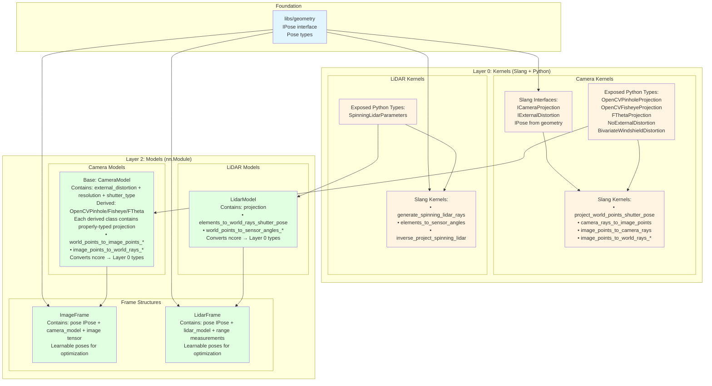
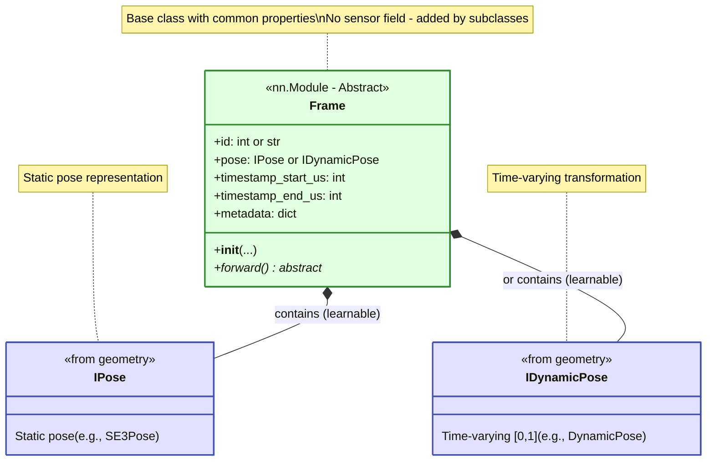
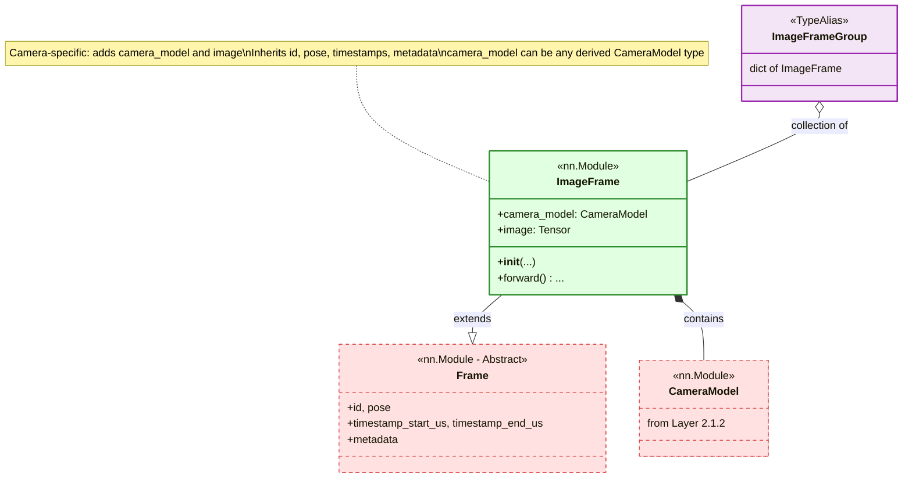
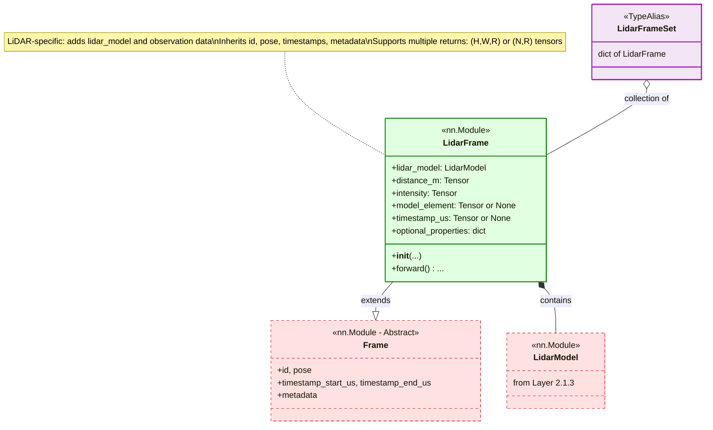
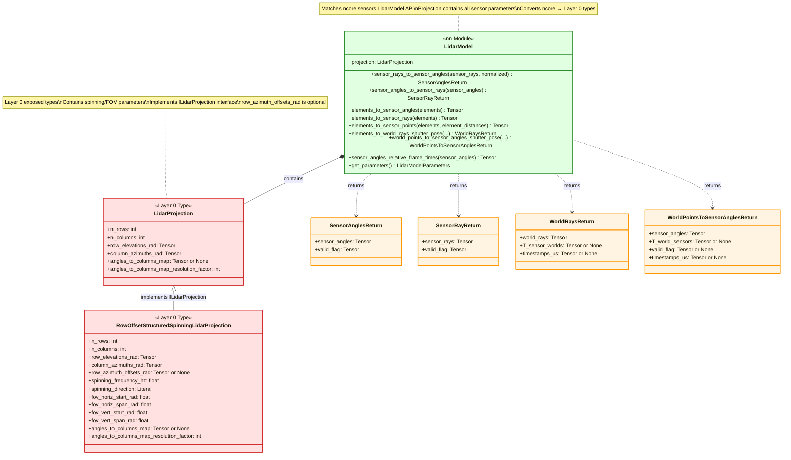

```mermaid
classDiagram
    direction TB

    class CameraModel {
        <<nn.Module - Abstract>>
        +external_distortion: ExternalDistortion
        +resolution: Tensor
        +shutter_type: ShutterType
        +world_points_to_image_points_static_pose(...) WorldPointsToImagePointsReturn
        +world_points_to_image_points_mean_pose(...) WorldPointsToImagePointsReturn
        +world_points_to_image_points_shutter_pose(...) WorldPointsToImagePointsReturn
        +world_points_to_pixels_static_pose(...) WorldPointsToPixelsReturn
        +world_points_to_pixels_mean_pose(...) WorldPointsToPixelsReturn
        +world_points_to_pixels_shutter_pose(...) WorldPointsToPixelsReturn
        +image_points_to_world_rays_static_pose(...) WorldRaysReturn
        +image_points_to_world_rays_mean_pose(...) WorldRaysReturn
        +image_points_to_world_rays_shutter_pose(...) WorldRaysReturn
        +pixels_to_world_rays_static_pose(...) WorldRaysReturn
        +camera_rays_to_image_points(...) ImagePointsReturn
        +image_points_to_camera_rays(...) Tensor
        +get_parameters() CameraModelParameters*
    }

    class OpenCVPinholeCameraModel {
        <<nn.Module>>
        +projection: OpenCVPinholeProjection
    }

    class OpenCVFisheyeCameraModel {
        <<nn.Module>>
        +projection: OpenCVFisheyeProjection
    }

    class FThetaCameraModel {
        <<nn.Module>>
        +projection: FThetaProjection
    }

    class OpenCVPinholeProjection {
        <<from Layer 0>>
        +focal_length: Tensor
        +principal_point: Tensor
        +radial_coeffs: Tensor
        +tangential_coeffs: Tensor
        +thin_prism_coeffs: Tensor
    }

    class OpenCVFisheyeProjection {
        <<from Layer 0>>
        +focal_length: Tensor
        +principal_point: Tensor
        +forward_poly: Tensor
        +...
    }

    class FThetaProjection {
        <<from Layer 0>>
        +principal_point: Tensor
        +fw_poly: Tensor
        +bw_poly: Tensor
        +...
    }

    class ExternalDistortion {
        <<from Layer 0>>
        NoExternal | BivariateWindshield
    }

    class ImagePointsReturn {
        +image_points: Tensor
        +valid_flag: Tensor
    }

    class WorldPointsToImagePointsReturn {
        +image_points: Tensor
        +T_world_sensors: Tensor or None
        +valid_flag: Tensor or None
        +timestamps_us: Tensor or None
    }

    class WorldPointsToPixelsReturn {
        +pixels: Tensor
        +T_world_sensors: Tensor or None
        +valid_flag: Tensor or None
        +timestamps_us: Tensor or None
    }

    class WorldRaysReturn {
        +world_rays: Tensor
        +T_sensor_worlds: Tensor or None
        +timestamps_us: Tensor or None
    }

    %% Relationships
    OpenCVPinholeCameraModel --|> CameraModel : extends
    OpenCVFisheyeCameraModel --|> CameraModel : extends
    FThetaCameraModel --|> CameraModel : extends
    OpenCVPinholeCameraModel *-- OpenCVPinholeProjection : contains
    OpenCVFisheyeCameraModel *-- OpenCVFisheyeProjection : contains
    FThetaCameraModel *-- FThetaProjection : contains
    CameraModel *-- ExternalDistortion : contains
    CameraModel ..> ImagePointsReturn : returns
    CameraModel ..> WorldPointsToImagePointsReturn : returns
    CameraModel ..> WorldPointsToPixelsReturn : returns
    CameraModel ..> WorldRaysReturn : returns

    %% Notes
    note for CameraModel "Base class with common properties\nDerived classes add properly-typed projections\nMatches ncore.sensors.CameraModel API"
    note for OpenCVPinholeProjection "Layer 0 exposed types\nContain camera-specific\noptical parameters"
    note for ImagePointsReturn "Nested return type for projection results"

    %% Styling
    style CameraModel fill:#ffe1e1,stroke:#d32f2f,stroke-width:1px,stroke-dasharray: 5 5
    style OpenCVPinholeCameraModel fill:#e1ffe1,stroke:#2d8c2d,stroke-width:2px
    style OpenCVFisheyeCameraModel fill:#e1ffe1,stroke:#2d8c2d,stroke-width:2px
    style FThetaCameraModel fill:#e1ffe1,stroke:#2d8c2d,stroke-width:2px
    style OpenCVPinholeProjection fill:#ffe1e1,stroke:#d32f2f,stroke-width:2px
    style OpenCVFisheyeProjection fill:#ffe1e1,stroke:#d32f2f,stroke-width:2px
    style FThetaProjection fill:#ffe1e1,stroke:#d32f2f,stroke-width:2px
    style ExternalDistortion fill:#ffe1e1,stroke:#d32f2f,stroke-width:2px
    style ImagePointsReturn fill:#fff4e1,stroke:#ff9800,stroke-width:2px
    style WorldPointsToImagePointsReturn fill:#fff4e1,stroke:#ff9800,stroke-width:2px
    style WorldPointsToPixelsReturn fill:#fff4e1,stroke:#ff9800,stroke-width:2px
    style WorldRaysReturn fill:#fff4e1,stroke:#ff9800,stroke-width:2px
```

## 1. Requirements Summary

\*Module Path:\*\* `libs/sensors/`

### 1.1 Sensor Support

**IN SCOPE:**

- **Camera Models:**
  - OpenCV Pinhole
  - OpenCV Fisheye
  - F-Theta (with polynomial distortion)
- **External Distortion**
  - Bivariate Windshield
- **LiDAR Models:**
  - Row-offset structured spinning LiDAR (Hesai, Waymo, Pandar)
- **Common Operations:**
  - Batch projection (ray generation)
  - Image/sensor coordinate transforms
  - Rolling shutter support (cameras and LiDARs)
    - Full rolling shutter projection with per-point pose interpolation
    - Convenience function for mean pose projection (faster, lower accuracy)
    - Static pose for back-projection (single pose for all rays)
- **LiDAR-Specific Operations (NCore API compatibility):**
  - Element ↔ sensor ray conversions (with/without range to 3D points)
  - Sensor ray ↔ sensor angle conversions
  - Relative frame time computation from sensor angles
  - World points → sensor angles with rolling shutter (iterative refinement)
  - **Note:** All operations have existing CUDA implementations in vren that will be ported to Slang

### 1.2 Acceleration Requirements

- **GPU-accelerated kernels** for batch operations:
  - Batch ray generation (cameras: pixels→rays, LiDARs: elements→rays)
  - Batch forward/inverse projection (rays↔image points)
  - Support for parameter derivatives (backward pass)
- **PyTorch integration**
- **CUDA stream support**: Kernels must be able to run on different CUDA streams to enable parallel processing of independent per-frame operations

### 1.3 Architecture Requirements

- **Strictly layered design:**
  - Layer 0: GPU kernels (Slang compute shaders) + Python bindings + parameter dataclasses
    - Simple, immutable data structures for sensor parameters
    - Functions work WITH structures (read from them) but never modify them
    - No hidden state or state changes
  - Layer 2: Stateful models (nn.Module) with learnable parameters
  - Layer 3: Data structures for parsed sensor datasets
- **Framework independence at lower layers**
- **Differentiable operations** for end-to-end training
- **Type-safe APIs** with proper tensor shape contracts

### 1.4 Dataset Handling Requirements

- **Parsed sensor data structures** for organizing captured sensor data:
  - Camera data (photos) with associated camera models
  - Sensor data groupings (e.g., multi-camera rigs, temporal sequences)
  - Flexible metadata support for dataset-specific attributes
  - Unique identification for each sensor observation
- **Type-safe data containers** for training pipelines
- **Extensible design** to accommodate future sensor types and metadata schemas

---

## 1.5 Architecture Overview

The following diagram shows the high-level architecture of the sensors module, illustrating the layered design and key components for both cameras and LiDARs:



**Legend:**

- 🔵 **Blue (Foundation)**: Geometry module with pose types and `IPose` interface
- 🟡 **Yellow (Layer 0)**: GPU kernels (Slang compute shaders) + Python bindings + parameter dataclasses
- 🟢 **Green (Layer 2)**: PyTorch `nn.Module` models and frames with learnable parameters and sensor data

**Key Design Principles:**

1. **Strict Layering**: Each layer depends only on layers below it (Layer 2 → Layer 0)
2. **Parallel Structure**: Camera and LiDAR follow identical architectural patterns
3. **Learnable Frames**: ImageFrame and LidarFrame in Layer 2 contain learnable `IPose` members and sensor model parameters for optimization
4. **Kernel-First**: Performance-critical operations implemented as Slang GPU kernels
5. **Exposed Types**: Layer 0 exposes Python dataclasses (mirroring Slang structs) that Layer 2 uses
6. **Composition over Inheritance**: Layer 2 models contain Layer 0 projection/parameter objects (e.g., `camera.projection.focal_length`)
7. **Clear Separation**: Layer 2 converts ncore config → Layer 0 working parameters; Layer 0 executes kernels
8. **NCore API Inspired**: Sensor models expose APIs similar to `ncore.sensors` interfaces with architectural improvements
9. **Direct Data Storage**: Frames directly contain sensor data as tensors (no intermediate data source abstractions)

---

## 1.6 NCore API Compatibility

The NRE sensor module maintains full compatibility with NCore sensor parameter packs. All sensor model implementations accept and produce the exact same parameter structures as their NCore counterparts, forming the interface contract between NCore and the NRE sensor module.

**Supported NCore Parameter Packs:**

### Camera Model Parameters

- **[`ncore.data.OpenCVPinholeCameraModelParameters`](https://nrs.gitlab-master-pages.nvidia.com/ncore/apis/data.html#ncore.data.OpenCVPinholeCameraModelParameters)**

  - Standard pinhole camera model with radial and tangential distortion
  - Parameters: focal length, principal point, distortion coefficients (k1, k2, p1, p2, k3)

- **[`ncore.data.OpenCVFisheyeCameraModelParameters`](https://nrs.gitlab-master-pages.nvidia.com/ncore/apis/data.html#ncore.data.OpenCVFisheyeCameraModelParameters)**

  - Wide-angle fisheye camera model using equidistant projection
  - Parameters: focal length, principal point, distortion coefficients (k1, k2, k3, k4)

- **[`ncore.data.FThetaCameraModelParameters`](https://nrs.gitlab-master-pages.nvidia.com/ncore/apis/data.html#ncore.data.FThetaCameraModelParameters)**
  - F-theta lens model with polynomial distortion
  - Parameters: focal length, principal point, polynomial coefficients

### External Distortion Parameters

- **[`ncore.data.BivariateWindshieldModelParameters`](https://nrs.gitlab-master-pages.nvidia.com/ncore/apis/data.html#ncore.data.BivariateWindshieldModelParameters)**
  - Bivariate polynomial model for windshield refraction effects
  - Applied after camera projection for through-glass imaging scenarios

### LiDAR Model Parameters

- **[`ncore.data.RowOffsetStructuredSpinningLidarModelParameters`](https://nrs.gitlab-master-pages.nvidia.com/ncore/apis/data.html#ncore.data.RowOffsetStructuredSpinningLidarModelParameters)**
  - Structured spinning LiDAR with row-offset geometry
  - Supports Hesai, Waymo, Pandar sensor configurations
  - Parameters: row offsets, azimuth/elevation angles, timing information

**Compatibility Note:** While the NRE sensor module uses the same parameter structures as NCore, the actual projection and transformation implementations are optimized GPU kernels written in Slang. This ensures identical numerical results with improved performance and differentiability for training.

---

## 2. Layered Architecture Design

### 2.1 Layer 2: Models (`libs/sensors/models/`)

**Purpose:** Stateful sensor models and frames with learnable parameters, inheriting from `nn.Module`. These use parameter dataclasses from Layer 0 and wrap them with PyTorch state management for training.

**API Design:** Sensor models expose APIs similar to `ncore.sensors`

**Key Concepts:**

- **nn.Module Wrappers**: PyTorch modules with learnable parameters for frames and sensor models
- **Learnable Poses**: Frames contain learnable `IPose` members for pose optimization
- **Learnable Sensor Models (intrinsics)** Sensor models contain learnable parameters for intrinsic optimizaton
- **Direct Data Storage**: Frames directly contain sensor observation tensors (images, range measurements)
- **Layer 0 Integration**: Converts ncore parameters to Layer 0 exposed projection types (e.g., `OpenCVPinholeProjection`)
- **Flexible Returns**: Optional flags to return poses, timestamps, valid indices, etc.

**Parameter Flow:**

1. Layer 2 models accept ncore configuration types on initialization (e.g., `ncore.data.OpenCVPinholeCameraModelParameters`)
2. Models compute derived values (e.g., derivative polynomials, transformation matrices)
3. Models create Layer 0 exposed types (e.g., `OpenCVPinholeProjection`) stored as `self.projection`
4. When calling kernels, models pass `self.projection` and `self.external_distortion` to Layer 0 bindings
5. Layer 2 methods can access projection parameters via `self.projection.focal_length`, etc.

---

#### 2.1.1 Frame Structures

**Purpose:** Trainable frame structures that associate sensor observations with learnable poses and sensor models. These enable pose optimization through gradient-based methods.

**Design:** A common base `Frame` class contains shared properties (id, sensor, pose, timestamps, metadata), with sensor-specific subclasses adding observation data.

##### 2.1.1.1 Base Frame

**Module:** `libs/sensors/models/frame.py`

**Class Diagram:**



**Implementation:**

```python
class Frame(nn.Module):
    """Base class for trainable sensor frames with learnable pose.

    Common frame properties shared by all sensor types (cameras, LiDARs).
    Subclasses add sensor-specific models and observation data.

    Use Cases:
    - Static pose: Fixed sensor position, global shutter, or when motion is negligible
    - Dynamic pose: Rolling shutter sensors, moving sensors, or temporal pose variation

    Attributes:
        id: Unique identifier for this frame (numeric preferred, string supported).
            The type of identifier is up to the user. This identifier is tied to the frame
            for the entire runtime, enabling quick lookup and access via FrameGroup types
            (e.g., ImageFrameGroup, LidarFrameSet). The id must be unique within a FrameGroup.
        pose: Learnable pose or dynamic pose (T_sensor_world or T_world_sensor)
              - IPose for static transformations
              - IDynamicPose for time-varying transformations (rolling shutter)
        timestamp_start_us: Frame start timestamp in microseconds (int64)
        timestamp_end_us: Frame end timestamp in microseconds (int64)
                         For global shutter: start == end
                         For rolling shutter: start < end (capture duration)
        metadata: Flexible metadata dictionary
    """

    def __init__(
        self,
        id: int | str,
        pose: Pose | DynamicPose,  # Can be static pose or time-varying dynamic pose
        timestamp_start_us: int,
        timestamp_end_us: int,
        metadata: dict[str, Any] | None = None,
    ):
        super().__init__()
        self.id = id
        self.pose = pose
        self.timestamp_start_us = timestamp_start_us
        self.timestamp_end_us = timestamp_end_us
        self.metadata = metadata or {}

    def forward(self, *args, **kwargs):
        """Forward pass - behavior depends on use case (e.g., projection, rendering)."""
        raise NotImplementedError("Frame.forward() must be implemented by subclasses")
```

---

##### 2.1.1.2 Image Frame

**Module:** `libs/sensors/models/image_frame.py`

**Class Diagram:**



**Implementation:**

```python
class ImageFrame(Frame):
    """A trainable camera frame extending Frame.

    Adds camera-specific model and observation data.
    Inherits common properties from Frame (id, pose, timestamps, metadata).

    Attributes (in addition to Frame attributes):
        camera_model: The camera model used to capture this frame (Layer 2.1.2)
                     Can be any derived CameraModel type (OpenCVPinholeCameraModel,
                     OpenCVFisheyeCameraModel, FThetaCameraModel)
        image: Image tensor (H, W, C) float32 [0, 1]
    """

    def __init__(
        self,
        id: int | str,
        camera_model: CameraModel,  # Base type accepts all derived camera models
        pose: Pose | DynamicPose,
        timestamp_start_us: int,
        timestamp_end_us: int,
        image: Tensor,  # (H, W, C)
        metadata: dict[str, Any] | None = None,
    ):
        super().__init__(
            id=id,
            pose=pose,
            timestamp_start_us=timestamp_start_us,
            timestamp_end_us=timestamp_end_us,
            metadata=metadata,
        )
        self.camera_model = camera_model
        self.register_buffer('image', image)

    def forward(self, *args, **kwargs):
        """Forward pass - behavior depends on use case (e.g., projection, rendering)."""
        raise NotImplementedError("ImageFrame.forward() should be implemented by subclasses or wrappers")


# Type alias for a collection of image frames indexed by ID
ImageFrameGroup = dict[int | str, ImageFrame]
```

---

##### 2.1.1.3 LiDAR Frame

**Module:** `libs/sensors/models/lidar_frame.py`

**Class Diagram:**



**Implementation:**

```python
class LidarFrame(Frame):
    """A trainable LiDAR frame extending Frame.

    Adds LiDAR-specific model and observation data.
    Inherits common properties from Frame (id, pose, timestamps, metadata).

    Data Format:
    - Dense: distance_m shape (H, W, R) - full range image with R returns per ray, model_element indices are implicit grid indices
    - Sparse: distance_m shape (N, R) - filtered measurements with explicit model_element (N, 2) indices
    - R: Maximum number of returns per ray (typically 1-4, common values: 1, 2, or 3)
    - Invalid returns marked with NaN (for distance_m) or 0.0 (for intensity)

    Frame-level timestamps vs Point-level timestamps:
    - timestamp_start_us/timestamp_end_us (from Frame): Frame capture interval
    - timestamp_us (LiDAR-specific): Per-point timestamps within frame interval
      Used for spinning LiDARs where each point has a unique capture time
      Note: Singular name (timestamp_us) following NCore convention for per-point values

    Attributes (in addition to Frame attributes):
        lidar_model: The LiDAR model used to capture this frame (Layer 2.1.3)
        distance_m: Distance measurements in meters float32
                   - Dense format: (H, W, R) - full range image with R returns per ray
                   - Sparse format: (N, R) - filtered measurements with R returns per ray
                   - R = max returns per ray (typically 1-4)
                   - Invalid/missing returns marked with NaN
        intensity: Intensity values float32 [0, 1]
                  - Dense format: (H, W, R)
                  - Sparse format: (N, R)
                  - Invalid/missing returns marked with 0.0
        model_element: Model element indices (N, 2) int32 [row, col] - only for sparse format
                      Specifies which (row, col) in the sensor model each measurement corresponds to
        timestamp_us: Per-point timestamps int64 or None
                     - Dense format: (H, W) or (H, W, R) - same timestamp for all returns or per-return
                     - Sparse format: (N,) or (N, R) - same timestamp for all returns or per-return
                     - For spinning LiDARs with rolling shutter
                     - Note: Singular name following NCore convention
        optional_properties: Dict of optional per-ray properties (e.g., elongation)

    Optional Properties (stored as buffers if present):
        elongation: Per-ray elongation/pulse width float32
                   - Dense format: (H, W, R)
                   - Sparse format: (N, R)
                   - Invalid/missing returns marked with NaN
        semantic_class: Semantic classification labels int32
                       - Dense format: (H, W, R) or (H, W) - per-return or per-ray
                       - Sparse format: (N, R) or (N,) - per-return or per-ray
    """

    def __init__(
        self,
        id: int | str,
        lidar_model: LidarModel,
        pose: Pose | DynamicPose,
        timestamp_start_us: int,
        timestamp_end_us: int,
        distance_m: Tensor,  # (H, W, R) or (N, R) float32 - distances in meters, R = max returns
        intensity: Tensor,  # (H, W, R) or (N, R) float32 [0, 1]
        model_element: Tensor | None = None,  # (N, 2) int32 - for sparse format only
        timestamp_us: Tensor | None = None,  # (H, W) or (N,) or (H, W, R) or (N, R) int64
        optional_properties: dict[str, Tensor] | None = None,
        metadata: dict[str, Any] | None = None,
    ):
        super().__init__(
            id=id,
            pose=pose,
            timestamp_start_us=timestamp_start_us,
            timestamp_end_us=timestamp_end_us,
            metadata=metadata,
        )
        self.lidar_model = lidar_model

        # Core properties (always present)
        self.register_buffer('distance_m', distance_m)
        self.register_buffer('intensity', intensity)

        # Sparse format support
        if model_element is not None:
            self.register_buffer('model_element', model_element)
        else:
            self.model_element = None

        # Per-point timestamps (for spinning LiDARs)
        if timestamp_us is not None:
            self.register_buffer('timestamp_us', timestamp_us)
        else:
            self.timestamp_us = None

        # Optional properties
        if optional_properties:
            for key, value in optional_properties.items():
                self.register_buffer(key, value)

    def forward(self, *args, **kwargs):
        """Forward pass - behavior depends on use case (e.g., projection, ray generation)."""
        raise NotImplementedError("LidarFrame.forward() should be implemented by subclasses or wrappers")


# Type alias for a collection of LiDAR frames indexed by ID
LidarFrameSet = dict[int | str, LidarFrame]
```

---

#### 2.1.2 Camera Models

**Module:** `libs/sensors/models/cameras.py`

**Class Diagram:**



**Return Types:**

```python
@dataclass
class ImagePointsReturn:
    """Return type for camera_rays_to_image_points"""
    image_points: Tensor              # (N, 2) float
    valid_flag: Tensor                # (N,) bool

@dataclass
class WorldPointsToImagePointsReturn:
    """Return type for world_points_to_image_points_* methods"""
    image_points: Tensor                    # (N, 2) float
    T_world_sensors: Optional[Tensor] = None  # (N, 4, 4) float - optional poses
    valid_flag: Optional[Tensor] = None      # (N,) bool - optional validity mask
    timestamps_us: Optional[Tensor] = None   # (N,) int64 - optional timestamps

@dataclass
class WorldPointsToPixelsReturn:
    """Return type for world_points_to_pixels_* methods"""
    pixels: Tensor                          # (N, 2) int
    T_world_sensors: Optional[Tensor] = None
    valid_flag: Optional[Tensor] = None     # (N,) bool
    timestamps_us: Optional[Tensor] = None

@dataclass
class WorldRaysReturn:
    """Return type for back-projection methods"""
    world_rays: Tensor                       # (N, 6) float - [origin, direction]
    T_sensor_worlds: Optional[Tensor] = None  # (N, 4, 4) float - optional poses
    timestamps_us: Optional[Tensor] = None    # (N,) int64 - optional timestamps
```

**Camera Model Classes:**

```python
from libs.sensors.kernels.cameras.parameters import (
    OpenCVPinholeProjection,
    OpenCVFisheyeProjection,
    FThetaProjection,
    ExternalDistortion,
    NoExternalDistortion,
    ShutterType,
)
from libs.sensors.kernels.cameras.interface import (
    project_world_points_shutter_pose,
    camera_rays_to_image_points,
    image_points_to_camera_rays,
    # ... other kernel functions
)
from geometry import Pose, DynamicPose  # Import from geometry module

class CameraModel(nn.Module):
    """Base camera model class for all projection types matching ncore.sensors.CameraModel API.

    This is an abstract base class. Use derived classes (OpenCVPinholeCameraModel,
    OpenCVFisheyeCameraModel, FThetaCameraModel) which contain properly-typed projection members.

    The base class contains common sensor properties shared across all camera types.
    Derived classes add projection-specific parameters and implement get_parameters().

    Wraps Layer 0 projection parameters as nn.Module state for gradient-based optimization.
    Calls Layer 0 kernel functions for projection operations.

    Note on Timestamps:
        - Static pose functions accept `Pose` objects which may contain an optional `timestamp_us` field
        - Dynamic pose-based functions (shutter_pose, mean_pose) use normalized time [0, 1]

    Example usage:
        # Create from ncore parameters - returns properly-typed derived class
        camera = OpenCVPinholeCameraModel.from_ncore_parameters(ncore_params)

        # Access projection parameters with proper typing
        fx, fy = camera.projection.focal_length  # Type: OpenCVPinholeProjection

        # Project world points using static pose
        pose = LearnableSE3Pose(T_init, timestamp_us=12345)  # Optional timestamp
        result = camera.world_points_to_image_points_static_pose(
            world_points, pose, return_timestamps=True  # Will return pose.timestamp_us
        )

        # Note: camera models are typically wrapped in an ImageFrame model for usage.
    """

    external_distortion: ExternalDistortion  # Layer 0 exposed type (NoExternal/Windshield)
    resolution: Tensor  # (2,) int32 - [width, height]
    shutter_type: ShutterType

    def __init__(
        self,
        external_distortion: ExternalDistortion,
        resolution: tuple[int, int],
        shutter_type: ShutterType,
    ):
        """
        Initialize base camera model with common sensor properties.

        Args:
            external_distortion: Layer 0 external distortion parameters
            resolution: (width, height) in pixels
            shutter_type: Rolling or global shutter behavior
        """
        super().__init__()
        self.external_distortion = external_distortion
        self.resolution = resolution
        self.shutter_type = shutter_type

    # ============================================================================
    # World Points to Image Points / Pixels
    # ============================================================================

    def world_points_to_image_points_static_pose(
        self,
        world_points: Tensor,     # (N, 3)
        pose: Pose,              # Static world → sensor pose (contains optional timestamp_us)
        return_T_world_sensors: bool = False,
        return_valid_flag: bool = False,
        return_timestamps: bool = False,
        return_all_projections: bool = False
    ) -> WorldPointsToImagePointsReturn:
        """Project world points using fixed sensor pose."""

    def world_points_to_image_points_mean_pose(
        self,
        world_points: Tensor,
        dynamic_pose: DynamicPose,  # Time-varying dynamic pose
        return_T_world_sensors: bool = False,
        return_valid_flag: bool = False,
        return_timestamps: bool = False,
        return_all_projections: bool = False
    ) -> WorldPointsToImagePointsReturn:
        """Project world points using mean pose (not compensating for sensor motion)."""

    def world_points_to_image_points_shutter_pose(
        self,
        world_points: Tensor,
        dynamic_pose: DynamicPose,  # Time-varying dynamic pose
        max_iterations: int = 10,
        stop_mean_error_px: float = 0.001,
        stop_delta_mean_error_px: float = 0.00001,
        return_T_world_sensors: bool = False,
        return_valid_flag: bool = False,
        return_timestamps: bool = False,
        return_all_projections: bool = False
    ) -> WorldPointsToImagePointsReturn:
        """Project world points using rolling-shutter compensation."""

    def world_points_to_pixels_static_pose(
        self,
        world_points: Tensor,
        pose: Pose,              # Static world → sensor pose (contains optional timestamp_us)
        return_T_world_sensors: bool = False,
        return_valid_flag: bool = False,
        return_timestamps: bool = False,
        return_all_projections: bool = False
    ) -> WorldPointsToPixelsReturn:
        """Project world points to pixel indices using fixed sensor pose."""

    # world_points_to_pixels_mean_pose, world_points_to_pixels_shutter_pose...

    # ============================================================================
    # Image Points / Pixels to World Rays
    # ============================================================================

    def image_points_to_world_rays_static_pose(
        self,
        image_points: Tensor,     # (N, 2)
        pose: Pose,              # Static sensor → world pose (contains optional timestamp_us)
        camera_rays: Optional[Tensor] = None,  # Optional pre-computed
        return_T_sensor_worlds: bool = False,
        return_timestamps: bool = False
    ) -> WorldRaysReturn:
        """Back-project image points to world rays using fixed sensor pose."""

    def image_points_to_world_rays_mean_pose(
        self,
        image_points: Tensor,
        dynamic_pose: DynamicPose,  # Time-varying dynamic pose
        camera_rays: Optional[Tensor] = None,
        return_T_sensor_worlds: bool = False,
        return_timestamps: bool = False
    ) -> WorldRaysReturn:
        """Back-project using mean pose (not compensating for sensor motion)."""

    def image_points_to_world_rays_shutter_pose(
        self,
        image_points: Tensor,
        dynamic_pose: DynamicPose,  # Time-varying dynamic pose
        camera_rays: Optional[Tensor] = None,
        return_T_sensor_worlds: bool = False,
        return_timestamps: bool = False
    ) -> WorldRaysReturn:
        """Back-project using rolling-shutter compensation."""

    def pixels_to_world_rays_static_pose(
        self,
        pixel_idxs: Tensor,       # (N, 2) int
        pose: Pose,              # Static sensor → world pose (contains optional timestamp_us)
        camera_rays: Optional[Tensor] = None,
        return_T_sensor_worlds: bool = False,
        return_timestamps: bool = False
    ) -> WorldRaysReturn:
        """Back-project pixel indices to world rays."""

    # pixels_to_world_rays_mean_pose, pixels_to_world_rays_shutter_pose...

    # ============================================================================
    # Camera Ray / Image Point Conversions
    # ============================================================================

def camera_rays_to_image_points(
        self,
        camera_rays: Tensor,      # (N, 3)
    ) -> ImagePointsReturn:
        """Convert camera rays to image points."""

def image_points_to_camera_rays(
        self,
        image_points: Tensor      # (N, 2)
) -> Tensor:
        """Convert image points to camera rays."""

    def pixels_to_camera_rays(
        self,
        pixel_idxs: Tensor        # (N, 2) int
) -> Tensor:
        """Convert pixel indices to camera rays."""

    def pixels_to_image_points(
        self,
        pixel_idxs: Tensor
    ) -> Tensor:
        """Convert pixel indices to continuous image point coordinates."""

    def image_points_to_pixels(
        self,
        image_points: Tensor
) -> Tensor:
        """Convert continuous image points to pixel indices."""

    # ============================================================================
    # Utilities
    # ============================================================================

    def image_points_relative_frame_times(
        self,
        image_points: Tensor
) -> Tensor:
        """Get relative frame-times [0,1] based on image coordinates and rolling shutter."""

    @abstractmethod
    def get_parameters(self) -> CameraModelParameters:
        """Returns the camera model parameters specific to this instance."""


# ====================================================================================
# Derived Camera Model Classes
# ====================================================================================

class OpenCVPinholeCameraModel(CameraModel):
    """OpenCV Pinhole camera model with properly-typed projection.

    Extends CameraModel with OpenCVPinholeProjection for type-safe parameter access.

    Example usage:
        # Create from ncore parameters
        camera = OpenCVPinholeCameraModel.from_ncore_parameters(ncore_params)

        # Access projection parameters with proper typing
        fx, fy = camera.projection.focal_length  # Type: Tensor (2,)
        k1, k2, k3 = camera.projection.radial_coeffs[:3]  # Radial distortion coefficients
    """

    projection: OpenCVPinholeProjection  # Layer 0 exposed type with proper typing

    def __init__(
        self,
        projection: OpenCVPinholeProjection,
        external_distortion: ExternalDistortion,
        resolution: tuple[int, int],
        shutter_type: ShutterType,
    ):
        """
        Initialize OpenCV Pinhole camera model.

        Args:
            projection: OpenCV Pinhole projection parameters
            external_distortion: Layer 0 external distortion parameters
            resolution: (width, height) in pixels
            shutter_type: Rolling or global shutter behavior
        """
        super().__init__(external_distortion, resolution, shutter_type)
        self.projection = projection

    @staticmethod
    def from_ncore_parameters(
        camera_model_parameters: OpenCVPinholeCameraModelParameters,
        device: Union[str, torch.device] = torch.device('cuda'),
        dtype: torch.dtype = torch.float32
    ) -> 'OpenCVPinholeCameraModel':
        """Initialize OpenCV Pinhole camera model from ncore parameters."""
        # Convert ncore parameters to Layer 0 projection type
        # Implementation details...
        pass

    def get_parameters(self) -> OpenCVPinholeCameraModelParameters:
        """Returns OpenCV Pinhole camera model parameters."""
        pass


class OpenCVFisheyeCameraModel(CameraModel):
    """OpenCV Fisheye camera model with properly-typed projection.

    Extends CameraModel with OpenCVFisheyeProjection for type-safe parameter access.

    Example usage:
        # Create from ncore parameters
        camera = OpenCVFisheyeCameraModel.from_ncore_parameters(ncore_params)

        # Access projection parameters with proper typing
        fx, fy = camera.projection.focal_length  # Type: Tensor (2,)
        distortion_coeffs = camera.projection.forward_poly  # Fisheye distortion (k1-k4)
    """

    projection: OpenCVFisheyeProjection  # Layer 0 exposed type with proper typing

    def __init__(
        self,
        projection: OpenCVFisheyeProjection,
        external_distortion: ExternalDistortion,
        resolution: tuple[int, int],
        shutter_type: ShutterType,
    ):
        """
        Initialize OpenCV Fisheye camera model.

        Args:
            projection: OpenCV Fisheye projection parameters
            external_distortion: Layer 0 external distortion parameters
            resolution: (width, height) in pixels
            shutter_type: Rolling or global shutter behavior
        """
        super().__init__(external_distortion, resolution, shutter_type)
        self.projection = projection

    @staticmethod
    def from_ncore_parameters(
        camera_model_parameters: OpenCVFisheyeCameraModelParameters,
        device: Union[str, torch.device] = torch.device('cuda'),
        dtype: torch.dtype = torch.float32
    ) -> 'OpenCVFisheyeCameraModel':
        """Initialize OpenCV Fisheye camera model from ncore parameters."""
        # Convert ncore parameters to Layer 0 projection type
        # Implementation details...
        pass

    def get_parameters(self) -> OpenCVFisheyeCameraModelParameters:
        """Returns OpenCV Fisheye camera model parameters."""
        pass


class FThetaCameraModel(CameraModel):
    """F-Theta camera model with properly-typed projection.

    Extends CameraModel with FThetaProjection for type-safe parameter access.

    Example usage:
        # Create from ncore parameters
        camera = FThetaCameraModel.from_ncore_parameters(ncore_params)

        # Access projection parameters with proper typing
        cx, cy = camera.projection.principal_point  # Type: Tensor (2,)
        fw_poly = camera.projection.fw_poly  # Forward polynomial coefficients
    """

    projection: FThetaProjection  # Layer 0 exposed type with proper typing

    def __init__(
        self,
        projection: FThetaProjection,
        external_distortion: ExternalDistortion,
        resolution: tuple[int, int],
        shutter_type: ShutterType,
    ):
        """
        Initialize F-Theta camera model.

        Args:
            projection: F-Theta projection parameters
            external_distortion: Layer 0 external distortion parameters
            resolution: (width, height) in pixels
            shutter_type: Rolling or global shutter behavior
        """
        super().__init__(external_distortion, resolution, shutter_type)
        self.projection = projection

    @staticmethod
    def from_ncore_parameters(
        camera_model_parameters: FThetaCameraModelParameters,
        device: Union[str, torch.device] = torch.device('cuda'),
        dtype: torch.dtype = torch.float32
    ) -> 'FThetaCameraModel':
        """Initialize F-Theta camera model from ncore parameters."""
        # Convert ncore parameters to Layer 0 projection type
        # Implementation details...
        pass

    def get_parameters(self) -> FThetaCameraModelParameters:
        """Returns F-Theta camera model parameters."""
        pass
```

---

#### 2.1.3 LiDAR Models

**Module:** `libs/sensors/models/lidars.py`

**Class Diagram:**



**Return Types:**

```python
@dataclass
class SensorAnglesReturn:
    """Return type for sensor ray to angle conversions"""
    sensor_angles: Tensor   # (N, 2) float - [elevation_rad, azimuth_rad]
    valid_flag: Tensor      # (N,) bool

@dataclass
class SensorRayReturn:
    """Return type for sensor angle to ray conversions"""
    sensor_rays: Tensor     # (N, 3) float - normalized direction vectors
    valid_flag: Tensor      # (N,) bool

@dataclass
class WorldRaysReturn:
    """Return type for back-projection methods"""
    world_rays: Tensor                       # (N, 6) float - [origin, direction]
    T_sensor_worlds: Optional[Tensor] = None  # (N, 4, 4) float - optional poses
    timestamps_us: Optional[Tensor] = None    # (N,) int64 - optional timestamps

@dataclass
class WorldPointsToSensorAnglesReturn:
    """Return type for world points to sensor angles projection"""
    sensor_angles: Tensor                    # (N, 2) float
    T_world_sensors: Optional[Tensor] = None  # (N, 4, 4) float - optional poses
    valid_flag: Optional[Tensor] = None      # (N,) bool - optional validity mask
    timestamps_us: Optional[Tensor] = None   # (N,) int64 - optional timestamps
```

**LiDAR Model Class:**

```python
from libs.sensors.kernels.lidars.parameters import (
    LidarProjection,
    RowOffsetStructuredSpinningLidarProjection,
)
from libs.sensors.kernels.lidars.interface import (
    generate_spinning_lidar_rays,
    elements_to_sensor_angles,
    inverse_project_spinning_lidar,
)
from geometry import Pose, DynamicPose  # Import from geometry module

class LidarModel(nn.Module):
    """Single LiDAR model class for all projection types matching ncore.sensors.LidarModel API.

    The projection member (Layer 0 exposed type) determines all sensor behavior including
    geometric projection, spinning characteristics (if applicable), and field of view.
    Wraps Layer 0 projection parameters as nn.Module state for gradient-based optimization.
    Calls Layer 0 kernel functions for projection operations.

    Like CameraModel, uses composition with ILidarProjection interface for polymorphism.

    Note on Timestamps:
        - Static pose functions accept `Pose` objects which may contain an optional `timestamp_us` field
        - If `return_timestamps=True`, the pose's timestamp (if present) will be returned in the results
        - Dynamic pose-based functions (shutter_pose) use normalized time [0, 1]
        - Timestamps are metadata only and do not affect the transformation computations

    Example usage:
        # Create from ncore parameters
        lidar = LidarModel.from_ncore_parameters(ncore_params)

        # Access projection parameters
        n_rows = lidar.projection.n_rows
        elevations = lidar.projection.row_elevations_rad

        # Generate rays with rolling shutter using dynamic pose
        result = lidar.elements_to_world_rays_shutter_pose(
            elements, dynamic_pose  # dynamic_pose: DynamicPose (e.g., LearnableDynamicPose)
        )
    """

    projection: LidarProjection  # Layer 0 exposed type (contains all parameters)

    def __init__(
        self,
        projection: LidarProjection,
    ):
        """
        Initialize LiDAR model with Layer 0 exposed projection type.

        Args:
            projection: Layer 0 projection parameters (includes all sensor parameters)
        """
        super().__init__()
        self.projection = projection

    @staticmethod
    def from_ncore_parameters(
        ncore_params: Union[ncore.data.StructuredLidarModelParameters,
                          ncore.data.RowOffsetStructuredSpinningLidarModelParameters],
        device: torch.device = torch.device('cuda')
    ) -> 'LidarModel':
        """Factory function to create LiDAR model from ncore parameters.

        Converts ncore parameters to Layer 0 projection types, including
        spinning and FOV parameters within the projection structure.
        """

    def sensor_rays_to_sensor_angles(
        self,
        sensor_rays: Tensor,
        normalized: bool = True
    ) -> SensorAnglesReturn:
        """Convert sensor rays to elevation/azimuth angles.

        Delegates to Layer 0 kernel based on projection type."""

def sensor_angles_to_sensor_rays(
        self,
        sensor_angles: Tensor
    ) -> SensorRayReturn:
        """Convert elevation/azimuth angles to sensor rays.

        Delegates to Layer 0 kernel based on projection type."""

    def elements_to_sensor_angles(
        self,
        elements: Tensor  # (N, 2) int - [row, column]
) -> Tensor:
        """Retrieves elevation and azimuth angles for elements.

        Delegates to Layer 0 kernel based on projection type."""

    def elements_to_sensor_rays(
        self,
        elements: Tensor  # (N, 2) int - [row, column]
    ) -> Tensor:
        """Convert elements to sensor rays.

        Combines elements_to_sensor_angles and sensor_angles_to_sensor_rays."""

    def elements_to_sensor_points(
        self,
        elements: Tensor,  # (N, 2) int - [row, column]
        element_distances: Tensor  # (N,) float
) -> Tensor:
        """Convert elements and distances to 3D sensor points."""

    def elements_to_world_rays_shutter_pose(
        self,
        elements: Tensor,
        dynamic_pose: DynamicPose,             # Time-varying dynamic pose
        sensor_rays: Optional[Tensor] = None,
        return_T_sensor_worlds: bool = False,
        return_timestamps: bool = False
    ) -> WorldRaysReturn:
        """Back-projects elements to world rays using rolling-shutter compensation."""

    def world_points_to_sensor_angles_shutter_pose(
        self,
        world_points: Tensor,        # (N, 3)
        dynamic_pose: DynamicPose,   # Time-varying dynamic pose
        max_iterations: int = 10,
        stop_mean_relative_time_error: float = 0.0001,
        stop_delta_mean_relative_time_error: float = 0.000001,
        return_T_world_sensors: bool = False,
        return_valid_flag: bool = False,
        return_timestamps: bool = False
    ) -> WorldPointsToSensorAnglesReturn:
        """Projects world points to sensor angles using rolling-shutter compensation."""

    def sensor_angles_relative_frame_times(
        self,
        sensor_angles: Tensor  # (N, 2) float
    ) -> Tensor:
        """Get relative frame-times [0,1] for sensor angle coordinates."""

    def get_parameters(self) -> ncore.data.LidarModelParameters:
        """Returns the lidar model parameters specific to this instance."""
```

---

### 2.2 Layer 0: Kernels (`libs/sensors/kernels/`)

**Purpose:** GPU kernels (Slang compute shaders) with PyTorch bindings, plus simple parameter data structures for performance-critical operations.

#### 2.2.1 Camera Kernels

**Module:** `libs/sensors/kernels/cameras/`

**Design Principle:** Template-specialized Slang kernels that work with camera parameter structures. Each camera model type (OpenCVPinhole, OpenCVFisheye, FTheta) has specialized implementations that handle model-specific projection, distortion, and back projection logic. No runtime polymorphism - everything is resolved at compile time for maximum performance.

**Projection Pipeline:**
The projection operates in the following sequence:

1. Transform world point to camera space (apply pose) - only in world→image kernels
2. Apply external distortion to camera ray (if present) - operates on 3D rays
3. Apply camera model distortion (pinhole/fisheye/f-theta) - operates on 2D normalized coordinates
4. Apply intrinsics to get final image pixel coordinates

**Slang Data Structures (matching model parameter packs in `ncore.data`):**

```slang
// Enums
enum ShutterType {
    GLOBAL = 0,
    ROLLING_TOP_TO_BOTTOM = 1,
    ROLLING_BOTTOM_TO_TOP = 2,
    ROLLING_LEFT_TO_RIGHT = 3,
    ROLLING_RIGHT_TO_LEFT = 4
}

// Camera projection interface: defines the core camera model operations
// All camera parameter types must implement this interface
interface ICameraProjection {
    // Project camera ray to image point (normalized coordinates + intrinsics)
    [Differentiable]
    float2 camera_rays_to_image_points(float3 camera_ray, out bool valid);

    // Back project image point to camera ray (inverse of above)
    [Differentiable]
    float3 image_points_to_camera_rays(float2 image_point);
}

// External distortion interface: defines 3D ray distortion operations
// External distortion is applied before the camera projection (earliest in pipeline)
interface IExternalDistortion {
    // Apply external distortion to a camera ray
    [Differentiable]
    float3 distort(float3 camera_ray);

    // Remove external distortion from a camera ray
    [Differentiable]
    float3 undistort(float3 distorted_ray);
}

// External distortion parameter structures
struct NoExternalDistortion : IExternalDistortion {
    // No parameters needed

    [Differentiable]
    float3 distort(float3 camera_ray);

    [Differentiable]
    float3 undistort(float3 distorted_ray);
}

struct BivariateWindshieldModelParameters : IExternalDistortion {
    enum ReferencePolynomial {
        FORWARD = 0,
        BACKWARD = 1
    }

    ReferencePolynomial reference_polynomial;
    uint h_poly_degree;
    uint v_poly_degree;
    float h_poly[10];
    float v_poly[10];
    float h_poly_inv[10];
    float v_poly_inv[10];

    // IExternalDistortion interface
    [Differentiable]
    float3 distort(float3 camera_ray);

    [Differentiable]
    float3 undistort(float3 distorted_ray);
}

// Camera projection parameter structures
struct OpenCVPinholeCameraModelParameters : ICameraProjection {
    float2 focal_length;               // (fx, fy)
    float2 principal_point;            // (cx, cy)
    float radial_coeffs[6];            // [k1, k2, k3, k4, k5, k6]
    float tangential_coeffs[2];        // [p1, p2]
    float thin_prism_coeffs[4];        // [s1, s2, s3, s4]

    // ICameraProjection interface
    [Differentiable]
    float2 camera_rays_to_image_points(float3 camera_ray, out bool valid);

    [Differentiable]
    float3 image_points_to_camera_rays(float2 image_point);
}

struct OpenCVFisheyeCameraModelParameters : ICameraProjection {
    float2 principal_point;            // (cx, cy)
    float2 focal_length;               // (fx, fy)

    // Forward distortion polynomial
    StructuredBuffer<float> forward_poly;       // [k1, k2, k3, k4]

    // Precomputed derivative for Newton iteration
    StructuredBuffer<float> dforward_poly;      // Derivative of forward polynomial

    // Approximate backward polynomial for back projection
    StructuredBuffer<float> approx_backward_poly;

    // Configuration
    float max_angle;                   // Maximum ray angle in radians
    int newton_iterations;             // Number of Newton iterations for undistortion
    float min_2d_norm;                 // Minimum 2D norm threshold

    // ICameraProjection interface
    [Differentiable]
    float2 camera_rays_to_image_points(float3 camera_ray, out bool valid);

    [Differentiable]
    float3 image_points_to_camera_rays(float2 image_point);
}

struct FThetaCameraModelParameters : ICameraProjection {
    enum FThetaPolynomialType {
        FORWARD = 0,
        BACKWARD = 1
    }

    FThetaPolynomialType reference_poly;
    float2 principal_point;            // (cx, cy)

    // Polynomial coefficients (variable degree)
    StructuredBuffer<float> fw_poly;   // Forward polynomial coefficients
    StructuredBuffer<float> bw_poly;   // Backward polynomial coefficients

    // Precomputed linear transformations
    float3x3 A;                        // Forward transformation matrix
    float3x3 Ainv;                     // Inverse transformation matrix

    // Derivative polynomials (for Newton iteration)
    StructuredBuffer<float> dfw_poly;  // Derivative of forward polynomial
    StructuredBuffer<float> dbw_poly;  // Derivative of backward polynomial

    // Configuration
    float max_angle;                   // Maximum ray angle in radians
    int newton_iterations;             // Number of Newton iterations for undistortion
    float min_2d_norm;                 // Minimum 2D norm threshold

    // ICameraProjection interface
    [Differentiable]
    float2 camera_rays_to_image_points(float3 camera_ray, out bool valid);

    [Differentiable]
    float3 image_points_to_camera_rays(float2 image_point);
}
```

**Dependencies:**
The camera kernels depend on pose and dynamic pose types from the `libs/geometry` module.

Pose and dynamic pose types must implement the following interfaces:

```slang
// Static pose interface - no temporal component
interface IPose {
    [Differentiable]
    float3 transform_point(float3 point);

    [Differentiable]
    float3 transform_direction(float3 direction);

    [Differentiable]
    float3 inverse_transform_point(float3 point);

    [Differentiable]
    float3 inverse_transform_direction(float3 direction);
}

// Dynamic pose interface - time-varying pose over normalized time [0, 1]
interface IDynamicPose {
    [Differentiable]
    IPose get_pose_at(float t);  // t in [0, 1]

    [Differentiable]
    IPose mean();

    [Differentiable]
    float3 transform_point_at(float3 point, float t);

    [Differentiable]
    float3 transform_direction_at(float3 direction, float t);
}
```

**Pose and Dynamic Pose Interface Notes:**

- **Static Poses (`IPose`)**: Static transformations with no temporal component. Used for fixed camera positions or single-pose operations.
- **Dynamic Poses (`IDynamicPose`)**: Time-varying transformations over normalized time [0, 1]. Used for rolling shutter within a frame, motion during exposure, and other short-duration pose variations.

**Template Instantiation:**
When calling kernels from Python via slangpy:

- Pass concrete pose/dynamic pose objects from the geometry module
- slangpy automatically determines template parameters from the actual types
- No manual type specification needed - compile-time type resolution ensures type safety and zero overhead

**Slang Compute Shaders (GPU Implementation):**

**Implementation Note:** The kernels below use the `ICameraProjection` interface for compile-time polymorphism. Each camera parameter type implements `ICameraProjection`, providing its own `camera_rays_to_image_points` and `image_points_to_camera_rays` methods. Resolution and shutter type are passed as separate parameters since they are sensor properties, not optical model properties.

```slang
// PRIMARY KERNEL: Projects world points with rolling shutter support
//
// Uses ICameraProjection and IExternalDistortion interfaces for camera model abstraction.
//
// Algorithm:
//   1. Transform world point to camera frame using start pose
//   2. Apply external distortion (if present) via external_distortion.distort()
//   3. Apply camera-specific projection via projection.camera_rays_to_image_points()
//   4. If global shutter: done
//   5. If rolling shutter: iterate N times to refine pose based on projection location
//      - Correct pose depends on where point projects (image row/column)
//      - Projection location depends on pose
//      - Requires iterative refinement (typically 10 iterations)
[Differentiable]
[shader("compute")]
[numthreads(256, 1, 1)]
void project_world_points_shutter_pose<
    Projection: ICameraProjection,
    ExternalDistortion: IExternalDistortion,
    T: IDynamicPose,
    let N_ROLLING_SHUTTER_ITERATIONS: int
>(
    Projection projection,                              // Camera model (implements ICameraProjection)
    ExternalDistortion external_distortion,             // External distortion (implements IExternalDistortion)
    uint2 resolution,                                   // (width, height)
    ShutterType shutter_type,                           // Shutter behavior
    T dynamic_pose,                                     // Time-varying dynamic pose
    StructuredBuffer<float3> world_points,              // (N, 3) in world coords
    RWStructuredBuffer<float2> image_points,            // output (N, 2)
    RWStructuredBuffer<bool> valid_flags,               // output (N,)
    RWStructuredBuffer<int64_t> timestamps_us_out,      // output (N,)
    RWStructuredBuffer<IPose> poses_out,                // output (N,) - per-point interpolated poses
    uniform uint3 dispatchThreadID : SV_DispatchThreadID
);

// HELPER KERNEL: Projects camera rays to image points (no pose transformation)
//
// Uses ICameraProjection and IExternalDistortion interfaces.
//
// IMPORTANT: This kernel assumes rays are ALREADY in camera frame at a specific time.
// NOT used for world→image with rolling shutter (that requires the fused kernel above).
// Use cases:
//   1. Back-projection validation: image → camera rays → image (round-trip testing)
//   2. Synthetic ray generation for testing
[Differentiable]
[shader("compute")]
[numthreads(256, 1, 1)]
void camera_rays_to_image_points<
    Projection: ICameraProjection,
    ExternalDistortion: IExternalDistortion
>(
    Projection projection,                              // Camera model (implements ICameraProjection)
    ExternalDistortion external_distortion,             // External distortion (implements IExternalDistortion)
    StructuredBuffer<float3> camera_rays,               // (N, 3) normalized rays
    RWStructuredBuffer<float2> image_points,            // output (N, 2)
    RWStructuredBuffer<bool> valid_flags,               // output (N,)
    uniform uint3 dispatchThreadID : SV_DispatchThreadID
) {
    uint idx = dispatchThreadID.x;
    float3 distorted_ray = external_distortion.distort(camera_rays[idx]);
    bool valid;
    image_points[idx] = projection.camera_rays_to_image_points(distorted_ray, valid);
    valid_flags[idx] = valid;
}

// BACK-PROJECTION KERNEL: Image points to camera rays
//
// Uses ICameraProjection and IExternalDistortion interfaces.
//
// Algorithm:
//   - Back-project image point to camera ray using camera-specific model
//   - Remove external distortion
//   - No pose needed - returns ray direction in camera frame
[Differentiable]
[shader("compute")]
[numthreads(256, 1, 1)]
void image_points_to_camera_rays<
    Projection: ICameraProjection,
    ExternalDistortion: IExternalDistortion
>(
    Projection projection,                              // Camera model (implements ICameraProjection)
    ExternalDistortion external_distortion,             // External distortion (implements IExternalDistortion)
    StructuredBuffer<float2> image_points,              // (N, 2)
    RWStructuredBuffer<float3> camera_rays,             // output (N, 3)
    uniform uint3 dispatchThreadID : SV_DispatchThreadID
) {
    uint idx = dispatchThreadID.x;
    float3 distorted_ray = projection.image_points_to_camera_rays(image_points[idx]);
    camera_rays[idx] = external_distortion.undistort(distorted_ray);
}

// CONVENIENCE: Project world points with mean pose (simplified, faster)
//
// Uses ICameraProjection and IExternalDistortion interfaces.
//
// Algorithm:
//   1. Compute mean pose: pose_mean = dynamic_pose.mean()
//   2. Transform all world points using pose_mean
//   3. Apply external distortion and projection
// This is faster than full rolling shutter but less accurate.
// Use cases: Global shutter cameras, preview rendering, when speed > accuracy
[Differentiable]
[shader("compute")]
[numthreads(256, 1, 1)]
void project_world_points_mean_pose<
    Projection: ICameraProjection,
    ExternalDistortion: IExternalDistortion,
    T: IDynamicPose
>(
    Projection projection,                              // Camera model (implements ICameraProjection)
    ExternalDistortion external_distortion,             // External distortion (implements IExternalDistortion)
    uint2 resolution,                                   // (width, height)
    T dynamic_pose,                                     // Time-varying dynamic pose - mean() will be called
    StructuredBuffer<float3> world_points,              // (N, 3) in world coords
    RWStructuredBuffer<float2> image_points,            // output (N, 2)
    RWStructuredBuffer<bool> valid_flags,               // output (N,)
    uniform uint3 dispatchThreadID : SV_DispatchThreadID
);

// CONVENIENCE: Back-project image points with static pose (single pose for all rays)
//
// Uses ICameraProjection and IExternalDistortion interfaces.
//
// Algorithm:
//   1. Back-project image point to camera ray using projection.image_points_to_camera_rays()
//   2. Remove external distortion
//   3. Transform camera ray to world using single static pose
// Use cases: Global shutter cameras, static scenes, ray casting from rendered images
[Differentiable]
[shader("compute")]
[numthreads(256, 1, 1)]
void image_points_to_world_rays_static_pose<
    Projection: ICameraProjection,
    ExternalDistortion: IExternalDistortion,
    P: IPose
>(
    Projection projection,                              // Camera model (implements ICameraProjection)
    ExternalDistortion external_distortion,             // External distortion (implements IExternalDistortion)
    uint2 resolution,                                   // (width, height)
    P pose,                                             // Static sensor → world pose
    StructuredBuffer<float2> image_points,              // (N, 2)
    RWStructuredBuffer<float> world_rays,               // output (N, 6) [origin.xyz, direction.xyz]
    uniform uint3 dispatchThreadID : SV_DispatchThreadID
);
```

---

**Python Layer: Parameter Dataclasses & Bindings**

The Python layer provides two components:

1. **Parameter dataclasses** - Import directly from `ncore.data` (optical properties only)
2. **Kernel bindings via slangpy** - Thin wrappers that launch the Slang compute shaders above

**Note on Architecture**: Camera parameter structures contain only optical properties (intrinsics, distortion coefficients). Sensor properties (resolution, shutter type) are stored separately in the Layer 2 `CameraModel` class and passed as function arguments to kernels. This separation reflects the fact that the same optical model can be used with different sensors.

**Note**: The Slang struct definitions (implementing `ICameraProjection`) are shown earlier in this section. They contain only optical properties - no `resolution` or `shutter_type` fields.

**Python Exposed Data Structures:**

These Python dataclasses mirror the Slang structs and are used by Layer 0 kernels. Layer 2 models convert from ncore types to these working parameter types.

```python
# Module: libs/sensors/kernels/cameras/parameters.py

from dataclasses import dataclass
from enum import IntEnum
import torch
from torch import Tensor

# Enums matching Slang
class ShutterType(IntEnum):
    GLOBAL = 0
    ROLLING_TOP_TO_BOTTOM = 1
    ROLLING_BOTTOM_TO_TOP = 2
    ROLLING_LEFT_TO_RIGHT = 3
    ROLLING_RIGHT_TO_LEFT = 4

class ReferencePolynomial(IntEnum):
    FORWARD = 0
    BACKWARD = 1

class FThetaPolynomialType(IntEnum):
    FORWARD = 0
    BACKWARD = 1

# External distortion (base class for type checking)
@dataclass
class ExternalDistortion:
    """Base class for external distortion parameters"""
    pass

@dataclass
class NoExternalDistortion(ExternalDistortion):
    """No external distortion - identity transformation"""
    pass

@dataclass
class BivariateWindshieldDistortion(ExternalDistortion):
    """Bivariate windshield distortion parameters (working parameters for GPU)"""
    reference_polynomial: ReferencePolynomial
    h_poly: Tensor  # (h_degree,) coefficients
    v_poly: Tensor  # (v_degree,) coefficients
    h_poly_inv: Tensor  # (h_degree,) inverse coefficients
    v_poly_inv: Tensor  # (v_degree,) inverse coefficients

# Camera projection parameters (base class for type checking)
@dataclass
class CameraProjection:
    """Base class for camera projection parameters"""
    pass

@dataclass
class OpenCVPinholeProjection(CameraProjection):
    """OpenCV Pinhole camera projection (working parameters for GPU)"""
    focal_length: Tensor  # (2,) [fx, fy]
    principal_point: Tensor  # (2,) [cx, cy]
    radial_coeffs: Tensor  # (6,) [k1, k2, k3, k4, k5, k6]
    tangential_coeffs: Tensor  # (2,) [p1, p2]
    thin_prism_coeffs: Tensor  # (4,) [s1, s2, s3, s4]

@dataclass
class OpenCVFisheyeProjection(CameraProjection):
    """OpenCV Fisheye camera projection (working parameters for GPU)"""
    principal_point: Tensor  # (2,) [cx, cy]
    focal_length: Tensor  # (2,) [fx, fy]
    forward_poly: Tensor  # (4,) [k1, k2, k3, k4]
    dforward_poly: Tensor  # (4,) derivative of forward polynomial
    approx_backward_poly: Tensor  # (4,) approximate backward polynomial
    max_angle: float
    newton_iterations: int
    min_2d_norm: Tensor  # scalar

@dataclass
class FThetaProjection(CameraProjection):
    """F-Theta camera projection (working parameters for GPU)"""
    reference_poly: FThetaPolynomialType
    principal_point: Tensor  # (2,) [cx, cy]
    fw_poly: Tensor  # (degree,) forward polynomial coefficients
    bw_poly: Tensor  # (degree,) backward polynomial coefficients
    A: Tensor  # (3, 3) forward transformation matrix
    Ainv: Tensor  # (3, 3) inverse transformation matrix
    dfw_poly: Tensor  # (degree,) derivative of forward polynomial
    dbw_poly: Tensor  # (degree,) derivative of backward polynomial
    max_angle: float
    newton_iterations: int
    min_2d_norm: Tensor  # scalar

__all__ = [
    'ShutterType',
    'ReferencePolynomial',
    'FThetaPolynomialType',
    'ExternalDistortion',
    'NoExternalDistortion',
    'BivariateWindshieldDistortion',
    'CameraProjection',
    'OpenCVPinholeProjection',
    'OpenCVFisheyeProjection',
    'FThetaProjection',
]
```

**Python Kernel Bindings (via slangpy):**

Thin wrappers that launch the Slang compute shaders. **No kernel logic is implemented in Python.**

These bindings accept the exposed Slang data structures directly. Layer 2 models handle conversion from ncore types to these working parameter types.

```python
# Module: libs/sensors/kernels/cameras/interface.py

from .parameters import (
    ShutterType,
    CameraProjection,
    ExternalDistortion,
    NoExternalDistortion,
)
from geometry import Pose, DynamicPose  # Import from geometry module
from typing import Optional
import torch
from torch import Tensor

def project_world_points_shutter_pose(
    world_points: Tensor,                          # (N, 3) in world coordinates
    projection: CameraProjection,                  # Camera projection parameters (OpenCVPinhole/Fisheye/FTheta)
    external_distortion: ExternalDistortion,       # External distortion (NoExternal/Windshield)
    resolution: tuple[int, int],                   # (width, height) in pixels
    shutter_type: ShutterType,                     # Shutter behavior
    dynamic_pose: DynamicPose,                     # Time-varying dynamic pose
) -> tuple[Tensor, Tensor, Tensor, list[Pose]]:
    """
    Project world points to image points with rolling shutter support.

    Direct binding to Slang kernel - no conversion logic here.
    Layer 2 models provide projection and external_distortion objects.

    Args:
        world_points: (N, 3) world coordinates
        projection: Exposed projection parameters (working parameters for GPU)
        external_distortion: Exposed external distortion parameters
        resolution: (width, height) sensor resolution
        shutter_type: Rolling shutter behavior
        dynamic_pose: Time-varying dynamic pose from geometry module

        Returns:
        image_points: (N, 2) projected pixel coordinates
        valid_flags: (N,) bool validity mask
        timestamps_us: (N,) int64 per-point timestamps
        poses: (N,) list of per-point interpolated poses
    """

def camera_rays_to_image_points(
    camera_rays: Tensor,                           # (N, 3) normalized direction vectors
    projection: CameraProjection,                  # Camera projection parameters
    external_distortion: ExternalDistortion,       # External distortion
    resolution: tuple[int, int],                   # (width, height) in pixels
) -> tuple[Tensor, Tensor]:
    """
    Project camera rays to image points (no pose transformation).

    Args:
        camera_rays: (N, 3) normalized rays in camera frame
        projection: Exposed projection parameters
        external_distortion: Exposed external distortion parameters
        resolution: (width, height) for boundary checks

        Returns:
        image_points: (N, 2)
        valid_flags: (N,) bool
    """

def image_points_to_camera_rays(
    image_points: Tensor,                          # (N, 2)
    projection: CameraProjection,                  # Camera projection parameters
    external_distortion: ExternalDistortion,       # External distortion
    resolution: tuple[int, int],                   # (width, height) in pixels
    ) -> Tensor:
        """
    Back-project image points to camera rays (no pose transformation).

    Args:
        image_points: (N, 2) pixel coordinates
        projection: Exposed projection parameters
        external_distortion: Exposed external distortion parameters
        resolution: (width, height) for boundary checks

        Returns:
        camera_rays: (N, 3) normalized directions in camera frame
    """

def image_points_to_world_rays_shutter_pose(
    image_points: Tensor,                          # (N, 2)
    projection: CameraProjection,                  # Camera projection parameters
    external_distortion: ExternalDistortion,       # External distortion
    resolution: tuple[int, int],                   # (width, height) in pixels
    shutter_type: ShutterType,                     # Shutter behavior
    dynamic_pose: DynamicPose,                     # Time-varying dynamic pose
) -> tuple[Tensor, Tensor, list[Pose]]:
    """
    Back-project image points to world rays with rolling shutter support.

    Args:
        image_points: (N, 2) pixel coordinates
        projection: Exposed projection parameters
        external_distortion: Exposed external distortion parameters
        resolution: (width, height) for determining relative frame position
        shutter_type: Rolling shutter direction or global
        dynamic_pose: Time-varying dynamic pose from geometry module

        Returns:
        world_rays: (N, 6) [origin.xyz, direction.xyz] in world frame
        timestamps_us: (N,) int64 per-point timestamps
        poses: (N,) list of per-point interpolated sensor-to-world poses
    """

def project_world_points_mean_pose(
    world_points: Tensor,                          # (N, 3) in world coordinates
    projection: CameraProjection,                  # Camera projection parameters
    external_distortion: ExternalDistortion,       # External distortion
    resolution: tuple[int, int],                   # (width, height) in pixels
    dynamic_pose: DynamicPose,                     # Time-varying dynamic pose
    ) -> tuple[Tensor, Tensor]:
        """
    Project world points to image points using mean pose (simplified, faster).

    The dynamic_pose.mean() method is called internally to compute the mean pose.
    Faster than full rolling shutter but less accurate.

    Args:
        world_points: (N, 3) world coordinates
        projection: Exposed projection parameters
        external_distortion: Exposed external distortion parameters
        resolution: (width, height) for boundary checks
        dynamic_pose: Time-varying dynamic pose - mean() will be called internally

        Returns:
        image_points: (N, 2) projected pixel coordinates
        valid_flags: (N,) bool validity mask
    """

def image_points_to_world_rays_static_pose(
    image_points: Tensor,                          # (N, 2)
    projection: CameraProjection,                  # Camera projection parameters
    external_distortion: ExternalDistortion,       # External distortion
    resolution: tuple[int, int],                   # (width, height) in pixels
    pose: Pose,                                    # Static sensor → world pose
    ) -> Tensor:
        """
    Back-project image points to world rays using single static pose.

    Uses the same pose for all rays (no interpolation).
    Equivalent to rolling shutter back-projection with global shutter.

    Args:
        image_points: (N, 2) pixel coordinates
        projection: Exposed projection parameters
        external_distortion: Exposed external distortion parameters
        resolution: (width, height) for boundary checks
        pose: Static sensor → world pose

        Returns:
        world_rays: (N, 6) [origin.xyz, direction.xyz] in world frame
    """
```

#### 2.2.2 LiDAR Kernels

**Module:** `libs/sensors/kernels/lidars/`

**Design Principle:** Purely functional API implemented in Slang. Spinning LiDAR ray generation with rolling shutter support.

**Dependencies:**
LiDAR kernels depend on pose types from the `libs/geometry` module (same interface as camera kernels).

Pose types must implement the `IPose` interface (see camera kernels section for full interface definition).
LiDAR kernels are templated on the pose type (`<P: IPose>`).
Template instantiation works identically to camera kernels - slangpy automatically determines `P` from the concrete pose type passed from Python.

**Slang Compute Shaders (GPU Implementation):**

```slang
// PRIMARY KERNEL: Element indices to world rays with rolling shutter
// Template parameters:
//   Projection: ILidarProjection - lidar projection model (StructuredLidar or RowOffsetStructuredSpinningLidar)
//   P: IPose - pose type for rolling shutter interpolation
// Algorithm:
//   1. Load element indices (row, col)
//   2. Compute sensor angles using projection.elements_to_sensor_angles()
//   3. Generate ray direction using projection.sensor_angles_to_sensor_rays()
//   4. Interpolate pose based on azimuth angle and spinning direction
//   5. Transform ray to world frame using interpolated pose
[Differentiable]
[shader("compute")]
[numthreads(256, 1, 1)]  // TBD
void generate_spinning_lidar_rays<Projection: ILidarProjection, T: IDynamicPose>(
    Projection projection,                              // LiDAR projection parameters
    T dynamic_pose,                                     // Time-varying dynamic pose (sensor motion)
    StructuredBuffer<int2> elements,                    // (N, 2) [row_idx, col_idx]
    RWStructuredBuffer<float> world_rays,               // output (N, 6) [origin.xyz, direction.xyz]
    RWStructuredBuffer<int64_t> timestamps_us_out,      // output (N,) per-ray timestamps
    RWStructuredBuffer<P> poses_out,                    // output (N,) per-ray interpolated poses
    uniform uint3 dispatchThreadID : SV_DispatchThreadID
);

// HELPER KERNEL: Element indices to sensor angles (for preprocessing/analysis)
// No pose transformation, just angle lookup via projection interface
[Differentiable]
[shader("compute")]
[numthreads(256, 1, 1)]  // TBD
void elements_to_sensor_angles<Projection: ILidarProjection>(
    Projection projection,                              // LiDAR projection parameters
    StructuredBuffer<int2> elements,                    // (N, 2) [row_idx, col_idx]
    RWStructuredBuffer<float2> sensor_angles,           // output (N, 2) [elevation, azimuth]
    uniform uint3 dispatchThreadID : SV_DispatchThreadID
);

// INVERSE KERNEL: World points to sensor angles with rolling shutter
// Algorithm:
//   1. Start with initial pose estimate based on azimuth FOV midpoint
//   2. Transform world point to sensor frame using current pose
//   3. Compute sensor angles using projection.sensor_rays_to_sensor_angles()
//   4. Refine pose based on azimuth (rolling shutter)
//   5. Iterate to converge
//   6. Validate angles are within sensor FOV
[Differentiable]
[shader("compute")]
[numthreads(256, 1, 1)]  // TBD
void inverse_project_spinning_lidar<Projection: ILidarProjection, T: IDynamicPose>(
    Projection projection,                              // LiDAR projection parameters
    T dynamic_pose,                                     // Time-varying dynamic pose (sensor motion)
    StructuredBuffer<float3> world_points,              // (N, 3) in world coords
    uniform int max_iterations,
    uniform float stop_mean_relative_time_error,
    uniform float stop_delta_mean_relative_time_error,
    RWStructuredBuffer<float2> sensor_angles,           // output (N, 2) [elevation, azimuth]
    RWStructuredBuffer<bool> valid_flags,               // output (N,) bool
    RWStructuredBuffer<int64_t> timestamps_us_out,      // output (N,) per-point timestamps
    RWStructuredBuffer<P> poses_out,                    // output (N,) per-point interpolated poses
    uniform uint3 dispatchThreadID : SV_DispatchThreadID
);
```

---

**Python Layer: Parameter Dataclasses & Bindings**

**Slang Interfaces:**

```slang
// Module: libs/sensors/kernels/lidars/interface.slang

// Interface for LiDAR projection models
// Defines the conversion between elements/rays/angles
interface ILidarProjection {
    // Convert sensor rays to sensor angles (elevation, azimuth)
    float2 sensor_rays_to_sensor_angles(float3 sensor_ray, bool normalized);

    // Convert sensor angles to sensor rays
    float3 sensor_angles_to_sensor_rays(float2 sensor_angles);

    // Convert element indices (row, col) to sensor angles
    float2 elements_to_sensor_angles(int2 element);
}
```

**Slang Data Structures:**

These structs implement `ILidarProjection` interface and contain working parameters for GPU execution. They mirror Python dataclasses defined in `ncore.data`:

```slang
// Module: libs/sensors/kernels/lidars/parameters.slang

enum SpinningDirection : int {
    CLOCKWISE = 0,      // "cw" in Python
    COUNTERCLOCKWISE = 1  // "ccw" in Python
};

// Structured spinning LiDAR projection (covers both basic and row-offset cases)
// Compatible with Hesai P128, Waymo, Pandar, and basic structured LiDARs
struct RowOffsetStructuredSpinningLidarProjection : ILidarProjection {
    // Structure
    int n_rows;
    int n_columns;

    // Geometry - tensor data (passed as StructuredBuffer in kernels)
    Tensor<float, 1> row_elevations_rad;      // (n_rows,) elevation angles
    Tensor<float, 1> column_azimuths_rad;     // (n_columns,) azimuth angles
    Tensor<float, 1> row_azimuth_offsets_rad; // (n_rows,) azimuth offsets - optional: can be empty/null for basic structured LiDAR

    // Spinning behavior - optional: use 0.0 / CLOCKWISE for static/basic LiDAR
    float spinning_frequency_hz;       // Rotation frequency (0.0 for non-spinning)
    SpinningDirection spinning_direction;  // CW or CCW

    // Field of view
    float fov_horiz_start_rad;  // Start of horizontal FOV
    float fov_horiz_span_rad;   // Span of horizontal FOV
    float fov_vert_start_rad;   // Start of vertical FOV
    float fov_vert_span_rad;    // Span of vertical FOV

    // Inverse projection optimization (optional precomputed map)
    Tensor<int, 2> angles_to_columns_map;     // Optional: precomputed map for sensor_rays_to_sensor_angles
    int angles_to_columns_map_resolution_factor;

    // Interface implementations
    float2 sensor_rays_to_sensor_angles(float3 sensor_ray, bool normalized);
    float3 sensor_angles_to_sensor_rays(float2 sensor_angles);
    float2 elements_to_sensor_angles(int2 element);
};
```

**Python Exposed Data Structures:**

These Python dataclasses mirror the Slang structs and are exposed by Layer 0 for use by Layer 2 models. They contain working parameters (tensors on GPU).

```python
# Module: libs/sensors/kernels/lidars/parameters.py

import torch
from torch import Tensor
from dataclasses import dataclass
from typing import Literal, Optional

@dataclass
class RowOffsetStructuredSpinningLidarProjection:
    """Structured spinning LiDAR projection (Layer 0 exposed type).

    Mirrors Slang RowOffsetStructuredSpinningLidarProjection struct.
    Contains working parameters for GPU execution.
    Compatible with row-offset models (Hesai P128, Waymo, Pandar) and basic structured LiDARs.

    For basic structured LiDAR (no row offsets):
    - Set row_azimuth_offsets_rad to None
    - Set spinning_frequency_hz to 0.0
    """
    n_rows: int
    n_columns: int
    row_elevations_rad: Tensor  # (n_rows,) float
    column_azimuths_rad: Tensor  # (n_columns,) float
    fov_horiz_start_rad: float
    fov_horiz_span_rad: float
    fov_vert_start_rad: float
    fov_vert_span_rad: float
    row_azimuth_offsets_rad: Optional[Tensor] = None  # (n_rows,) float - optional for basic structured LiDAR
    spinning_frequency_hz: float = 0.0  # 0.0 for non-spinning LiDAR
    spinning_direction: Literal['cw', 'ccw'] = 'cw'  # Default to clockwise
    angles_to_columns_map: Optional[Tensor] = None  # Optional: (height, width) int - precomputed inverse map
    angles_to_columns_map_resolution_factor: int = 1


# Type alias for any LiDAR projection
LidarProjection = RowOffsetStructuredSpinningLidarProjection

__all__ = [
    'RowOffsetStructuredSpinningLidarProjection',
    'LidarProjection',
]
```

**Python Kernel Bindings (via slangpy):**

Layer 0 kernel bindings expose the projection types directly, not ncore parameters. Layer 2 models convert ncore parameters to Layer 0 types before calling kernels.

```python
# Module: libs/sensors/kernels/lidars/interface.py

from .parameters import (
    LidarProjection,
    RowOffsetStructuredSpinningLidarProjection,
)
from geometry import Pose, DynamicPose
import torch
from torch import Tensor
from typing import Union

def generate_spinning_lidar_rays(
    projection: LidarProjection,                               # Layer 0 projection parameters
    elements: Tensor,                                          # (N, 2) [row, col]
    dynamic_pose: DynamicPose,                                 # Time-varying dynamic pose (sensor motion)
) -> tuple[Tensor, Tensor, list[Pose]]:
    """
    Generate world rays for spinning LiDAR with rolling shutter.

    Uses ILidarProjection interface for projection operations - works with any projection type.

    Args:
        projection: Layer 0 exposed projection parameters (RowOffsetStructuredSpinningLidarProjection)
        elements: (N, 2) element indices [row_idx, col_idx]
        dynamic_pose: Time-varying dynamic pose

    Returns:
        world_rays: (N, 6) [origin.xyz, direction.xyz] in world frame
        timestamps_us: (N,) int64 per-ray timestamps
        poses: (N,) list of per-ray interpolated poses
    """

def elements_to_sensor_angles(
    projection: LidarProjection,                               # Layer 0 projection parameters
    elements: Tensor,                                          # (N, 2) [row, col]
) -> Tensor:
    """
    Convert element indices to sensor angles (no pose transformation).

    Uses ILidarProjection interface - works with any projection type.

    Args:
        projection: Layer 0 exposed projection parameters
        elements: (N, 2) element indices [row_idx, col_idx]

    Returns:
        sensor_angles: (N, 2) [elevation_rad, azimuth_rad]
    """

def inverse_project_spinning_lidar(
    projection: LidarProjection,                               # Layer 0 projection parameters
    world_points: Tensor,                                      # (N, 3)
    dynamic_pose: DynamicPose,                                 # Time-varying dynamic pose (sensor motion)
    max_iterations: int = 10,
    stop_mean_relative_time_error: float = 0.0001,
    stop_delta_mean_relative_time_error: float = 0.000001,
) -> tuple[Tensor, Tensor, Tensor, list[Pose]]:
    """
    Inverse project world points to sensor angles with rolling shutter.

    Uses ILidarProjection interface for projection operations - works with any projection type.
    Uses iterative refinement to handle rolling shutter projection.

    Args:
        projection: Layer 0 exposed projection parameters
        world_points: (N, 3) world coordinates
        dynamic_pose: Time-varying dynamic pose
        max_iterations: Maximum iterations for convergence
        stop_mean_relative_time_error: Stopping criterion for mean error
        stop_delta_mean_relative_time_error: Stopping criterion for error change

    Returns:
        sensor_angles: (N, 2) [elevation_rad, azimuth_rad]
        valid_flags: (N,) bool
        timestamps_us: (N,) int64 per-point timestamps
        poses: (N,) per-point sensor poses
    """
```
