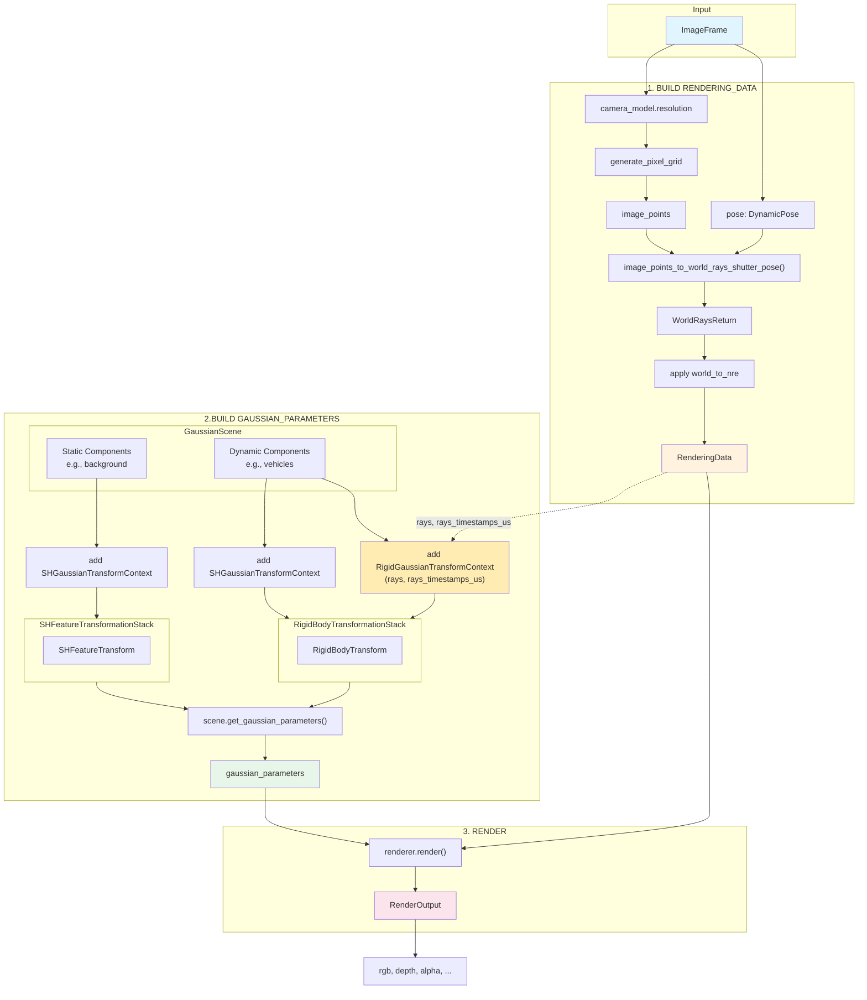

# Stage Module

## Overview

The Stage module provides a unified interface to the `GaussianScene`, `TransformationStack`, and `BaseGaussianRenderer`.

**Core Principle**: Stage owns the scene, transformation stack, and renderer. It exposes a single `render(ImageFrame)` API

---

## Components and Their Roles

| Component                        | Role                                                                                                                                                                                                        |
| -------------------------------- | ----------------------------------------------------------------------------------------------------------------------------------------------------------------------------------------------------------- |
| **GaussianScene**                | Unified buffer owner. Holds all gaussian parameters (positions, rotations, scales, densities, radiance) in contiguous memory. Provides O(1) component access via offset/size mappings.                      |
| **GaussianComponent**            | Data container + transform context carrier. Represents a semantic partition (e.g., "background", "vehicle_1") as views into Scene buffers. Carries `ITransformContext` instances for downstream transforms. |
| **SHFeatureTransformationStack** | Applies `SHFeatureTransform` to **static** components. Interpolates time-dependent Fourier features for spherical harmonics based on frame timestamp.                                                       |
| **RigidBodyTransformationStack** | Applies `RigidBodyTransform` to **dynamic** components. Handles track pose calibration, pose interpolation, and per-track modifiers. Requires `rays` and `rays_timestamps_us` from RenderingData.           |
| **BaseGaussianRenderer**         | Renders gaussian parameters to image outputs (rgb, depth, alpha). Takes some `rendering_data` + `gaussian_parameters`.                                                                                      |

### Data Flow

1. **Input**: `ImageFrame` (camera_model, pose, timestamps..)
2. **Build RenderingData**: Generate rays from sensor pose
3. **Build GaussianParameters**:
   - Static components → `SHFeatureTransformationStack` → transformed features
   - Dynamic components → `RigidBodyTransformationStack` → transformed poses
   - Return combined output from the TransformationStacks or call `scene.get_gaussian_parameters()`
4. **Render**: `renderer.render(rendering_data, gaussian_parameters)` → `RenderOutput`

---

## API

```python
class Stage:
    """
    Unified rendering interface combining scene, transforms, and renderer.
    """

    def __init__(
        self,
        scene: GaussianScene,
        renderer: BaseGaussianRenderer,
        transform_stack: TransformationStack,
    ) -> None:
        """
        Initialize Stage.

        Args:
            scene: GaussianScene containing all components
            renderer: Renderer for gaussian splatting
            transform_stack: Pre-configured transformation pipeline
        """
        ...

    def render(self, frame: ImageFrame) -> RenderOutput:
        """
        Render a frame.

        Args:
            frame: ImageFrame from sensor library containing:
                   - camera_model: CameraModel (intrinsics + resolution)
                   - pose: DynamicPose (sensor-to-world, rolling shutter)
                   - timestamp_start_us, timestamp_end_us

        Returns:
            RenderOutput with rgb, depth, alpha, etc.
        """
        ...
```

## Workflow Diagram (Mermaid)



---

## Key Design Decisions

### 1. RenderingData → TransformContext Dependency

The `RigidGaussianTransformContext` requires `rays` and `rays_timestamps_us` from `RenderingData`. This means:

- **RenderingData must be built first** (step 1)
- **Transforms depend on sensor data** (step 2 uses output from step 1)

### 3. Static vs Dynamic Components

- **Static components** (e.g., background): No transforms applied, parameters used directly from scene
- **Dynamic components** (e.g., vehicles): Transformed via TransformationStack each frame

---

## Usage Example

```python
# Initialize stage
stage = Stage(
    scene=gaussian_scene,
    renderer=gaussian_renderer,
    transform_stack=TransformationStack(
        name="dynamics",
        transforms=[SHFeatureTransform(), RigidBodyTransform()],
    )
)

# Render a frame
frame = ImageFrame(
    id="cam_front_0",
    camera_model=camera_model,
    pose=dynamic_pose,
    timestamp_start_us=1000000,
    timestamp_end_us=1033333,
    image=None,  # Not needed for rendering
)

output = stage.render(frame)
rgb_image = output.rgb  # [H, W, 3]
```

---

## References

- **GaussianScene:** See `scene.md` for scene data structure and component management
- **TransformationStack:** See `transforms.md` for transformation pipeline
- **ImageFrame:** From proposed sensor library (`libs/sensors/`)
- **RenderingData:** Internal structure for renderer (`nre/utils/batch.py`)
