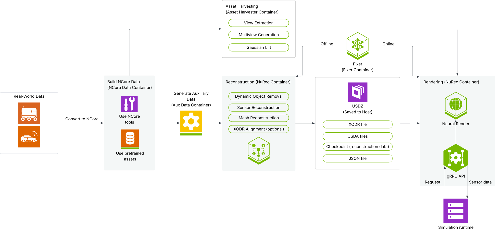

.. include:: _includes/_global_substitutions.rst

=======================
NVIDIA Omniverse NuRec
=======================

NVIDIA Omniverse NuRec refers to the neural reconstruction and rendering models and services from NVIDIA that support the seamless ingestion of real-world
camera and lidar data to create a simulated 3D environment suitable for training and testing Physical AI Agents, including robotics and autonomous driving systems.

Reconstruction and Rendering with NuRec
---------------------------------------

|nurec| encompasses multiple sub-components that work together to provide the core |nurec| service.

   |nurec| overview

Data compatibility with NuRec
#############################

**The NCore data format** is a standardized format for sensor data recordings from various sources, including camera and lidar sensors.

1. Ensure data quality: Make sure your real-world data includes the required inputs and meets a baseline standard of quality to ensure the best reconstruction output.
2. Get NCore data: You then need to `convert your real-world data into the NCore format <ncore/convert>`_. Alternatively, you can skip this step and the reconstruction steps if you get pre-trained
   sample data that is already in the NCore format from the `NVIDIA Physical AI dataset on HuggingFace <https://huggingface.co/datasets/nvidia/PhysicalAI-Autonomous-Vehicles-NuRec>`_  and
   and then `render the Physical AI dataset with NuRec <nurec/physical-ai-data>`_. 
3. Validate data quality: After you've acquired NCore-formatted data, use the `data quality toolkit <ncore/validate>`_ to validate the quality of your data and its readiness for |nurec|.
4. Generate additional required data: `Generate Aux Data <ncore/nurec-aux-data>`_ for additional data required by the reconstruction engine.

Reconstruction
###############

**Reconstruction** converts real-world data into a 3D scene, output as a USDZ file. The reconstruction engine is inside the main NuRec container.
The USDZ file is a zipped package that includes the following files:

* **XODR file**: A driveable map for use in the simulation.
* **USDA files**: Default file that defines the scene using Universal Scene Description (USD) and includes mapping, domelight, sequence tracks (cuboid tracks), and rig trajectories (logs of all trajectories).
* **Checkpoint**: This is the actual AI-trained reconstruction data, including GS positions, auxiliary data.
* **JSON**: Sequence track and rig trajectories are also available in this format.

**Asset Harvester** is a system of 5 models (Mask2Former, C-RADIO, Sana Multiview, LGM, Fixer) that converts actors and objects from the dataset to 3D assets. This is available as a separate container.

Rendering
##########

**Rendering** leverages `3D Gaussian Unscented Transform (3DGUT) <https://research.nvidia.com/labs/toronto-ai/3DGUT/>`_. Find the rendering engine inside the main NuRec container.
You can use the `NuRec gRPC API <api/grpc_api_guide>`_ to neurally render scenes in your simulation platform. If you use the NVIDIA Physical AI dataset, follow the instructions in
`Render the Physical AI dataset with NuRec <nurec/physical-ai-data>`_.

**Fixer (Difix3D+)** refines and smooths the rendering of the scene. The current model is based on the text-to-image
framework `Sana <https://nvlabs.github.io/Sana/>`_, but soon will transition to `Cosmos <https://arxiv.org/html/2501.03575v1>`_. The Stable Diffusion version is
available on HuggingFace or as a separate container on NGC.

.. toctree::
   :caption: About NuRec
   :hidden:
   :maxdepth: 2
   :glob:

    Overview <self>
    Release Notes <release-notes/index>

.. toctree::
   :caption: Setup
   :hidden:
   :maxdepth: 2
   :glob:

    Hardware <basics/hardware>
    Software <basics/software>

.. toctree::
   :caption: Data
   :hidden:
   :maxdepth: 2
   :glob:

    Prepare Your Data <basics/get-data>
    Ensure Data Quality <ncore/data-quality>
    Convert Data to NCore <ncore/convert>
    Validate Your Data <ncore/validate>
    Generate Auxiliary Data <ncore/nurec-aux-data>

.. toctree::
   :caption: Reconstruct
   :hidden:
   :maxdepth: 2
   :glob:

    Use the NuRec Model <nurec/model>
    Get 3D Assets with Asset Harvester <nurec/asset-harvester>
    Use Asset Harvester Output in Reconstructions <nurec/use-ah-assets>

.. toctree::
   :caption: Render
   :hidden:
   :maxdepth: 2
   :glob:

    Render the Physical AI Dataset <nurec/physical-ai-data>
    Use the NuRec gRPC API <api/grpc_api_guide>
    Refine Rendering with Fixer <nurec/fixer>

.. toctree::
   :caption: Research
   :hidden:
   :maxdepth: 2
   :glob:

    Use the Fixer Model <https://huggingface.co/nvidia/Difix3D/>
    Use the 3DGRUT Model <nurec/3dgrut>

.. toctree::
   :caption: gRPC API Reference
   :hidden:
   :maxdepth: 2
   :glob:

    Packages <api/index>
    common <api/common>
    sensorsim <api/sensorsim>

.. toctree::
   :caption: NCore Data Format Reference
   :hidden:
   :maxdepth: 3
   :glob:

    NCore Data Types <ncore/types>
    NCore Conventions <ncore/reference/conventions>
    Sample: Waymo to NCore <ncore/waymo-conversion-flow>
    NCore API: Packages <ncore/reference/apis/ncore>
    NCore API: Data <ncore/reference/apis/data>
    NCore API: Data V3 <ncore/reference/apis/data-v3>
    NCore API: Sensors <ncore/reference/apis/sensors>
    NCore API: Install <ncore/reference/apis/install>