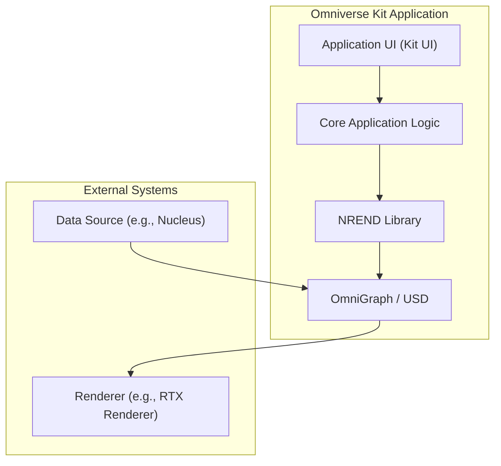

# NREND Release Plan

## Introduction

This document outlines the official process and policies for releasing new versions of the NREND library. It covers the versioning scheme, release types, schedule, build and release procedures, and communication strategies to ensure a smooth and predictable release cycle.

## 1. Versioning Scheme

The NREND library adheres to a specific versioning format to provide clear information about the nature of each release. This scheme is consistent with the versioning used by the NuRec (neural reconstruction engine) software.

The format is: `<major>.<minor>.<commits>-<githash>`

- **major:** This number is incremented for significant, incompatible changes to the public API.
- **minor:** This number is incremented for new features and improvements that are backward-compatible.
- **commits:** This is the number of git merge commits since the last minor version update, providing a granular sense of change.
- **githash:** This is the abbreviated git commit hash of the build, allowing for precise identification of the source code version.

**Example:** `0.2.703-771a5a2d`

## 2. Release Types

NREND has several types of releases, each serving a different purpose.

- **Major Releases:** These are for significant new features and may include breaking changes to the API. They are released infrequently and with extensive communication.
- **Minor Releases:** These introduce new, backward-compatible functionality and improvements.

## 3. Release Schedule Cadence

We follow a regular monthly release cadence, which is aligned with the NuRec (neural reconstruction engine) release schedule. A new version of NREND is released on the 25th of each month. This regular schedule applies to all release types, providing a predictable and consistent update cycle.

## 4. Supported Platforms and Requirements

The library is officially supported on the following platforms and configurations, as specified in the SRD.

- **Operating Systems:**
  - Linux (x86_64, aarch64)
  - Windows (x86_64)
- **Hardware:**
  - NVIDIA GPU with CUDA Compute Capability 7.5 (Turing) or higher.
- **Software:**
  - NVIDIA CUDA Toolkit (version aligned with the target Omniverse release).
  - C++17 compliant compiler.

## 5. Roles and Responsibilities

The release process involves several key roles to ensure a smooth and successful deployment.

- **NuRec Project Lead:** Acts as the Release Manager. This role owns the release schedule, makes the final go/no-go decision for a release, and serves as the primary point of contact for all stakeholders.
- **Development Team:** Responsible for developing new features, fixing bugs, ensuring that all code merged into the `main` branch meets quality standards, and maintaining the GitLab CI/CD pipelines used for building, testing, and deploying NREND.

## 6. Branching Strategy

The NREND release process is directly tied to the branching strategy of the NuRec (`nrs/nre`) source code repository.

- **Main Branch:** The `main` branch serves as the primary integration branch for ongoing development.
- **Release Branches:** On branching day, a release branch is created from a stable commit on the `main` branch. It follows the naming convention `release/YY.MM`, where `YY` represents the last two digits of the year and `MM` is the month of release.
- **Stabilization:** This branch is protected and is used for final testing, polishing, and critical bug fixes. All changes must go through a formal Merge Request (MR) process. This allows the `main` branch to remain open for new feature development for subsequent releases.
- **Tagging for Release:** Once the release branch is deemed stable, a final release tag is created on the head of that branch. This tag is what triggers the NREND build and deployment pipeline.

## 7. Release Build Process & Pre-release Checklist

### Build Process

The NREND release process is triggered by a new release tag in the NuRec repository. This triggers the automated build, test, and deployment process, which is encapsulated within GitLab CI pipelines in the NREND GitLab project.

1.  **Release Trigger:** A new release tag is created in the NuRec GitLab project. This action automatically triggers the NREND release pipeline.
2.  **Automated Build & Packaging:** The pipeline builds the library and assembles a release package for all supported platforms. The package is created using the Omniverse Packman tool and includes the compiled shared libraries (`.so`/`.dll`), all public C++ headers, and a VERSION file.
3.  **Artifact Storage:** The generated release package for each platform is stored as a build artifact within the NREND GitLab project.
4.  **Automated Deployment:** A dedicated pipeline job uploads the final NREND package from the GitLab artifacts to the Omniverse Artifactory.

- **NREND GitLab Project (Pipelines):** `https://gitlab-master.nvidia.com/omniverse/nrend`
- **NuRec GitLab Project (Trigger):** `https://gitlab-master.nvidia.com/nrs/nre`

### Pre-release Checklist

- [ ] All unit, integration, and regression tests are passing on all supported platforms.
- [ ] Performance benchmarks have been run and results meet the targets for supported GPU architectures (Turing, Ampere, Hopper).
- [ ] Numerical stability tests have been passed to ensure repeatable outputs.
- [ ] The Doxygen API documentation is updated to reflect any changes in the release.
- [ ] Example applications have been tested and updated to use the new release correctly.
- [ ] The release notes have been collated and are ready for publication.
- [ ] All code has been reviewed and merged into the release branch.
- [ ] All blocking issues and critical bugs slated for the release have been resolved and verified.

## 8. Accessing Released Packages

The NREND library is published to the Omniverse Artifactory. The official packages can be found at:
`https://omnipackages.nvidia.com/packages/artifactory/nrend`

The release package is created using the Omniverse Packman tool and includes the compiled binaries, public C++ headers, and a VERSION file. The corresponding debug symbols are published separately to the Omniverse Symbolserver.

## 9. Release Notes

Clear and comprehensive release notes are crucial for communicating changes to our users.

- **Collation Process:** Release notes are compiled from git commit messages, pull request descriptions, and our issue tracking system.
- **Format:** Release notes are organized into the following sections:
  - `New Features`
  - `Improvements`
  - `Bug Fixes`
  - `Breaking Changes`
- **Storage:** Release notes are maintained in a shared [Google Doc](https://docs.google.com/document/d/1b4XrIl7aURbQKE0IgHqJPMFpHq9R_e1Hb7pR3Opy3aQ/edit?usp=sharing).

## 10. Communication Plan

Effective communication is key to a successful release.

- **Announcements:** Release announcements are sent via email to a list of stakeholders. For convenience, a message is also posted to the `#nre-dev-core` Slack channel.
- **Breaking Changes:** Any breaking changes will be communicated well in advance of a major release. We will provide detailed migration guides to help users adapt their code.
- **Audience:** Communication will be tailored to the relevant audience, whether they are developers using the library, project managers planning roadmaps, or end-users of applications built with NREND.

## 11. Rollback Plan

A rollback is an emergency procedure invoked if a release introduces a critical, high-impact issue after deployment.

- **Criteria for Rollback:** A rollback is considered if a bug is discovered that severely impacts a critical feature for a significant number of users, and an immediate fix is not available. The decision is made by the NuRec Project Lead.
- **Procedure:**
  1.  **Communication:** An urgent announcement is sent to all stakeholders, advising them to avoid the defective version and continue using the previous stable release.
  2.  **Artifact Management:** The faulty package is deprecated or removed from the Omniverse Artifactory to prevent further use.
  3.  **Resolution:** The critical issue is investigated with the highest priority. A fix is developed and merged to `main` to be included in the next scheduled monthly release.

## 12. NREND Integration in an Omniverse Kit Application

The following diagram illustrates how the NREND library is integrated as a core component within a standard Omniverse Kit-based application. It sits between the core application logic and the Omniverse scene representation (USD/OmniGraph), feeding rendered data to the RTX renderer.

## 13. References

NREND is a core component of the NuRec (Neural Reconstruction Engine) project. For more information, refer to the following resources:

- **NuRec Project Page:** <https://confluence.nvidia.com/display/NUREC/NeuralReconstruction>
- **NuRec GitLab Project (Source Code):** <https://gitlab-master.nvidia.com/nrs/nre>
- **NREND GitLab Project (Pipelines):** <https://gitlab-master.nvidia.com/omniverse/nrend>
- **Package Repository:** Released NREND packages are available on the Omniverse Artifactory at <https://omnipackages.nvidia.com/packages/artifactory/nrend>.
- **Release Notes:** <https://confluence.nvidia.com/display/NUREC/NRE+-+Release+Notes>
- **Software Requirements Document (SRD):** <https://gitlab-master.nvidia.com/nrs/nre/-/blob/main/libs/nrend/docs/NREND_SRD.md>
